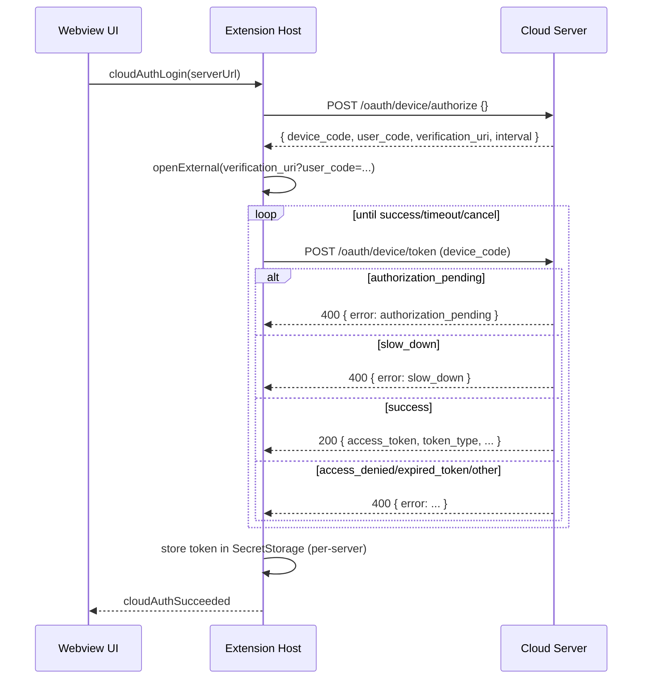
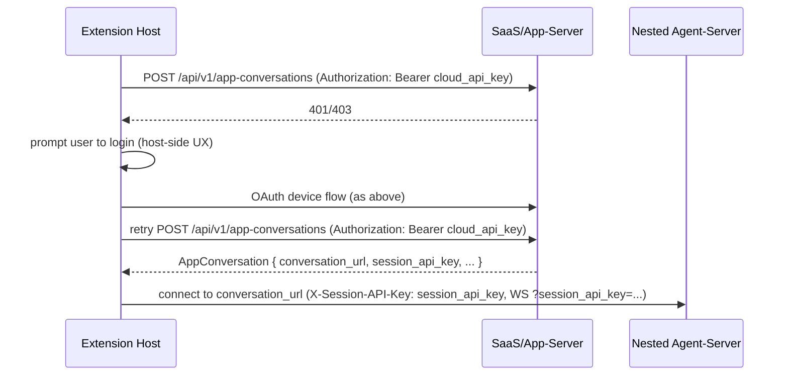

# OpenHands Cloud auth: OAuth 2.0 Device Flow (oh-tab design)

Bead: `oh-tab-voc.1` (investigation + design)

## Goal

Enable **remote** conversations against OpenHands Cloud servers (e.g. `app.all-hands.dev`) by obtaining and storing a **cloud API key / SaaS user token** via **OAuth 2.0 Device Authorization Grant (“Device Flow”)**, matching the existing OpenHands-CLI behavior.

Non-goals (for this bead):
- Implement the flow end-to-end in oh-tab (covered by follow-up beads `oh-tab-voc.2+`).
- Define cloud-side auth policies or server changes.

Important:
- The Device Flow `access_token` is a **cloud/SaaS user API key**, not the per-sandbox/runtime **agent-server `session_api_key`**. See `docs/cloud-auth-flow.md`.

## Current oh-tab behavior (baseline)

- Remote mode uses `settings.secrets.sessionApiKey` (currently a misnomer) as its single “remote auth key” slot (see `packages/agent-sdk-ts/src/workspace/RemoteWorkspace.ts` and `packages/agent-sdk-ts/src/sdk/conversation/RemoteConversation.ts`).
- The UI/helptext currently calls this “Session API Key”, even when it is actually a **cloud/SaaS API key** (device-flow output).
- Tokens are stored in VS Code SecretStorage via `SettingsManager` / `VscodeSettingsAdapter` as `context.secrets` entries (see `src/settings/SettingsManager.ts` + `src/settings/VscodeSettingsAdapter.ts`).

## Clarification: two different keys (very important)

OpenHands Cloud remote mode involves two different secrets:

1) **Cloud API key / SaaS user token** (Device Flow `access_token`)
   - Used to authenticate requests to the **SaaS/app-server** surface (e.g. `app.all-hands.dev`).
   - Transport: `Authorization: Bearer <cloud_api_key>`.
   - This is what the OpenHands-CLI stores in `~/.openhands/cloud/api_key.txt`.

2) **Runtime session API key** (`session_api_key`, sandbox/runtime-scoped)
   - Used to authenticate requests to the **nested runtime agent-server** (HTTP + WS).
   - Transport (HTTP): `X-Session-API-Key: <runtime_session_api_key>`.
   - Transport (WS today): query param `?session_api_key=<runtime_session_api_key>` (see `oh-tab-h3g`).

The cloud API key is **not** the same as the runtime `session_api_key`.

## Target architecture (explicit 2-stage flow)

Goal: after cloud login, use the cloud API key to discover the nested agent-server URL and runtime `session_api_key`, then connect directly to the agent-server.

1) Login (Device Flow) against the SaaS/app-server (e.g. `https://app.all-hands.dev`)
   - Store the **cloud API key** per server.
2) Use the cloud API key to call **V1** app-server endpoints to obtain nested runtime connection info:
   - Prefer `/api/v1/app-conversations*` endpoints that return `AppConversation` records including:
     - `conversation_url` (contains the nested agent-server base URL)
     - `session_api_key` (runtime/sandbox credential)
   - Continue to document legacy `/api/conversations*` for compatibility, but avoid depending on it.
3) Connect to the nested agent-server directly
   - Base URL: derived from `conversation_url`
   - Auth: `X-Session-API-Key: <runtime_session_api_key>` and (today) WS `?session_api_key=...`

## Reference implementation: OpenHands-CLI

OpenHands-CLI repo: local checkout (paths vary by developer machine).

### Device Flow client

File: `openhands_cli/auth/device_flow.py`

Endpoints and payloads:
- `POST /oauth/device/authorize` with JSON body `{}`.
  - Expected response JSON fields:
    - `device_code: string`
    - `user_code: string`
    - `verification_uri: string`
    - `verification_uri_complete?: string` (some servers provide a prebuilt URL)
    - `interval: number` (seconds)
- `POST /oauth/device/token` with form data (CLI sends `data=...`, i.e. form-urlencoded).
  - Success: `200` with JSON containing at least `access_token` and `token_type`.
  - Errors (non-200): CLI expects JSON `{ error, error_description? }` with common cases:
    - `authorization_pending` → keep polling
    - `slow_down` → back off (spec typically implies “increase polling interval”; CLI doubles up to 30s)
    - `expired_token` → fail (restart login)
    - `access_denied` → fail (user rejected)

UX:
- CLI constructs `verification_url = verification_uri + "?user_code=" + user_code` (or uses a server-provided `verification_uri_complete` if present)
- Tries to open browser, otherwise prints the URL and waits.
- Polling timeout default: 10 minutes.

### Token storage

File: `openhands_cli/auth/token_storage.py`

- Location: `~/.openhands/cloud/api_key.txt` (derived from `PERSISTENCE_DIR = ~/.openhands`).
- Format: plain text (just the key), file mode `0600`.

### Post-auth behavior (settings sync)

File: `openhands_cli/auth/api_client.py`

After auth, CLI fetches and prints/syncs:
- `GET /api/keys/llm/byor` (BYO LLM key)
- `GET /api/settings`
- (Also has `GET /api/user/info` helper and `POST /api/conversations` helper.)

Note: oh-tab may or may not want to mirror this “sync” step; see “Open questions”.

## Design: oh-tab implementation plan

### Architecture placement

Recommendation:
- Keep auth orchestration in **extension host** (needs VS Code APIs + SecretStorage + safe UX):
  - new module(s) under `src/auth/`
- Keep only small, pure helpers in `src/shared/` (e.g. server URL normalization already lives there).
- Avoid putting auth logic into `packages/agent-sdk-ts` for now; the SDK should remain transport-agnostic and accept “sessionApiKey” as an input.

### Token storage model (per-server)

Problem:
- oh-tab currently stores a single `openhands.sessionApiKey` and treats it as “the remote auth key”.
- But cloud mode needs two distinct keys (cloud user token vs runtime `session_api_key`), and users can have multiple `settings.servers[]`.

Recommendation:
- Store the **cloud API key** per canonical SaaS server URL in VS Code SecretStorage.
- Treat runtime `session_api_key` as runtime/sandbox-scoped data (generally obtained from V1 conversation metadata and not reused across unrelated sandboxes).

Suggested secret keys:
- `openhands.cloudApiKey` (new legacy-ish key for backwards compatibility)
- `openhands.cloudApiKey.server.<hash>` (server-specific cloud token)
- `openhands.cloudApiKey.server.<hash>.meta` (optional JSON metadata; e.g. `{ serverUrl, obtainedAt, tokenType, expiresAt? }`)

Compatibility note:
- Until the schema/code is migrated, oh-tab may temporarily keep storing the cloud API key in `openhands.sessionApiKey*` (misnamed). The UI should still call it “Cloud API Key” for SaaS servers.

Where `<hash>` is a stable hash of the normalized server URL (e.g. SHA-256 hex of `normalizeServerUrl(url).url`).

Lookup rules:
1. Normalize server URL (`normalizeServerUrl`).
2. Attempt per-server key first.
3. Fall back to the legacy key (so existing manual workflows keep working).

Write rules:
- Whenever a token is obtained for a server, always store it in the per-server key.
- Do **not** silently clobber the legacy key if it already contains a different value.
  - If the legacy key is empty/unset, or already matches the per-server token for the currently-selected server, it is OK to write it for backwards compatibility.
  - Otherwise leave it unchanged and rely on the per-server key as the authoritative source.

### CLI token reuse (optional)

CLI stores a cloud token at `~/.openhands/cloud/api_key.txt`.

Feasibility:
- oh-tab can read this file using Node’s `os.homedir()` + `path.join(...)`.
- The file is not keyed by server URL; it represents “whatever CLI last logged into”.

Recommended behavior:
- If the per-server token is missing, attempt “import from CLI” as a best-effort:
  1. If `~/.openhands/cloud/api_key.txt` exists and contains a non-empty token:
  2. Validate it against the selected server (e.g. call `GET /api/user/info` or a cheap authenticated endpoint).
  3. If valid, store it in the per-server SecretStorage key and proceed.
  4. If invalid, ignore and fall back to running device flow.

UX/security:
- Do not silently “copy secrets” without user awareness. Prefer a prompt:
  - “Import your existing OpenHands-CLI login for this server?” [Import] [No]
- Never log the token to output channels.

### Device flow orchestration (host-side)

New extension-host service (proposed):
- `CloudAuthService` (name bikeshed)
  - `startDeviceFlow(serverUrl) -> { deviceCode, userCode, verificationUri, verificationUrl, intervalSeconds }`
  - `pollForToken(serverUrl, deviceCode, intervalSeconds, { timeoutMs, onStatus }) -> { accessToken, tokenType, expiresIn? }`
  - `login(serverUrl) -> token` (does `start` + open browser + poll + store)
  - `logout(serverUrl) -> void` (clears per-server token + legacy key when applicable)

Transport details:
- Use `fetch` from extension host.
- `POST /oauth/device/authorize` JSON body `{}`.
- `POST /oauth/device/token` with `application/x-www-form-urlencoded` body. For maximum interoperability, include:
  - `grant_type=urn:ietf:params:oauth:grant-type:device_code`
  - `device_code=<...>`
  - (Optional, if required by the server) `client_id=<...>`
- Error parsing should mirror CLI’s `error` values.

Verification URL construction:
- Build `verificationUrl` via `new URL(verification_uri)` and `url.searchParams.set('user_code', user_code)` so we don’t break servers that already include query params (avoid manual string concatenation).

VS Code UX:
- Use `vscode.env.openExternal(vscode.Uri.parse(verificationUrl))`.
- Show a modal/progress UI with cancel:
  - `vscode.window.withProgress({ location: Notification, cancellable: true }, ...)`
- Provide “Copy code” and “Copy URL” affordances (either buttons in notifications or quick-picks).

### Webview integration

Recommended triggers:
- Add a command surfaced in UI:
  - “Login to server …” (in server selector popover and/or command palette)
- Add an automatic prompt when:
  - User switches to remote mode and the selected server responds `401/403`.
  - HAL teleport attempts to connect and auth is missing/invalid.

Suggested message contract (webview ↔ host):
- Webview → host: `command: 'cloudAuthLogin' | 'cloudAuthLogout'`
- Host → webview:
  - `cloudAuthStarted { serverUrl, verificationUrl, userCode }`
  - `cloudAuthPolling { serverUrl, nextPollInSeconds }` (optional)
  - `cloudAuthSucceeded { serverUrl }`
  - `cloudAuthFailed { serverUrl, error }`

The host should remain the source of truth for token storage; webview should never receive the token value.

### Header compatibility (Bearer vs X-Session-API-Key)

CLI uses `Authorization: Bearer <token>` for `/api/*` calls.

Important:
- For OpenHands Cloud/SaaS calls, **do not** send the cloud API key as `X-Session-API-Key`.
- Use `Authorization: Bearer <cloud_api_key>` for SaaS/app-server APIs.
- Reserve `X-Session-API-Key` for the runtime/sandbox `session_api_key` when calling the nested agent-server.

If a cloud deployment only works with `X-Session-API-Key` for SaaS endpoints, treat that as a server-side compatibility quirk and document it explicitly (do not make it the default client behavior).

## Sequence diagrams

### User-initiated login

### Auto-login on 401 during remote connect

## Threat model (extension-side)

Primary risks and mitigations:
- **Token leakage via logs/UI**: never print tokens to OutputChannel, toasts, or webview messages. Keep the token in extension host only and persist it only in VS Code SecretStorage.
- **Accidental token overwrite**: avoid silently replacing `openhands.sessionApiKey` when it differs (per “Write rules”); prefer server-scoped secrets as authoritative.
- **Phishing / malicious serverUrl**: show the canonical server URL being logged into and the exact verification URL opened; require explicit user action to start login. Avoid auto-login loops without user confirmation.
- **Replay / long-lived tokens**: treat access tokens as sensitive long-lived secrets; if the server provides expiry metadata (`expires_in`) or refresh tokens, store metadata (not secrets) separately and plan for re-auth / refresh.
- **Compromised machine / extension host**: SecretStorage reduces accidental exposure but cannot defend against a fully compromised host; keep scope minimal (no additional token replication beyond SecretStorage).

## Test plan (follow-up beads `oh-tab-voc.2+`)

Suggested coverage to unblock implementation:
- **Unit (host)**: device-flow polling state machine (`authorization_pending`, `slow_down` backoff, `expired_token`, `access_denied`, timeout, cancel).
- **Unit (storage)**: per-server secret key selection, and the “do not clobber legacy key” write rules.
- **E2E (VS Code)**:
  - Login command opens browser + persists per-server token.
  - Remote connect with missing/invalid token shows a host-side prompt; after login, the connection retries and succeeds.

## Open questions / follow-ups

1. **Settings sync parity:** Should oh-tab fetch `/api/settings` after login (like CLI) and update local UI defaults for remote mode?
2. **Token expiry:** If the access token expires, what is the expected renewal mechanism (re-login vs refresh token)?
3. **Multi-server tokens:** Should UI expose “Logged in as …” per server and allow per-server logout?
4. **Header scheme:** Confirm that OpenHands Cloud (SaaS) accepts `Authorization: Bearer <cloud_api_key>` for all endpoints used by remote mode.
