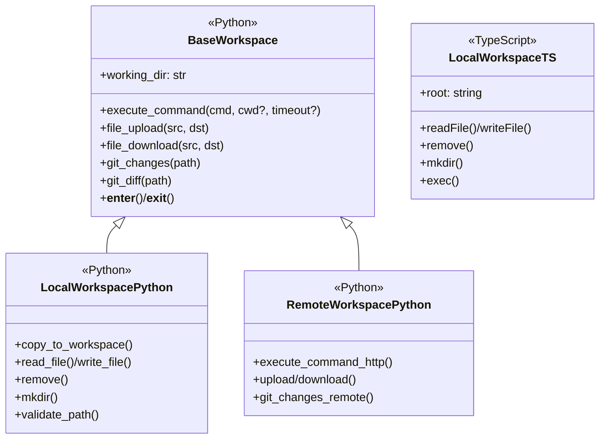
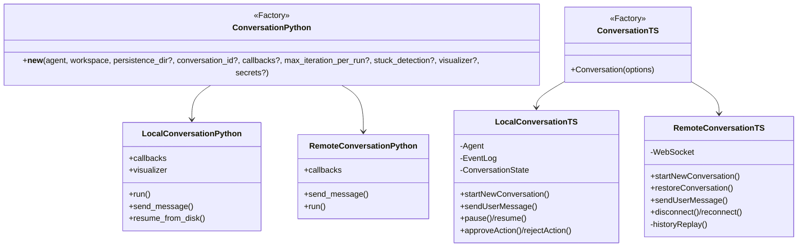
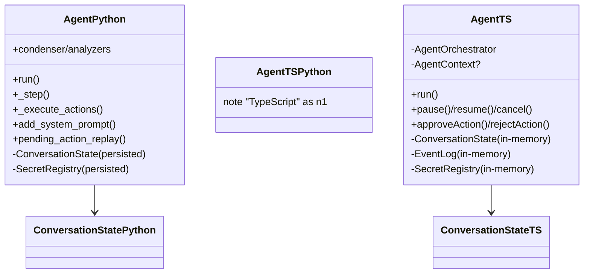
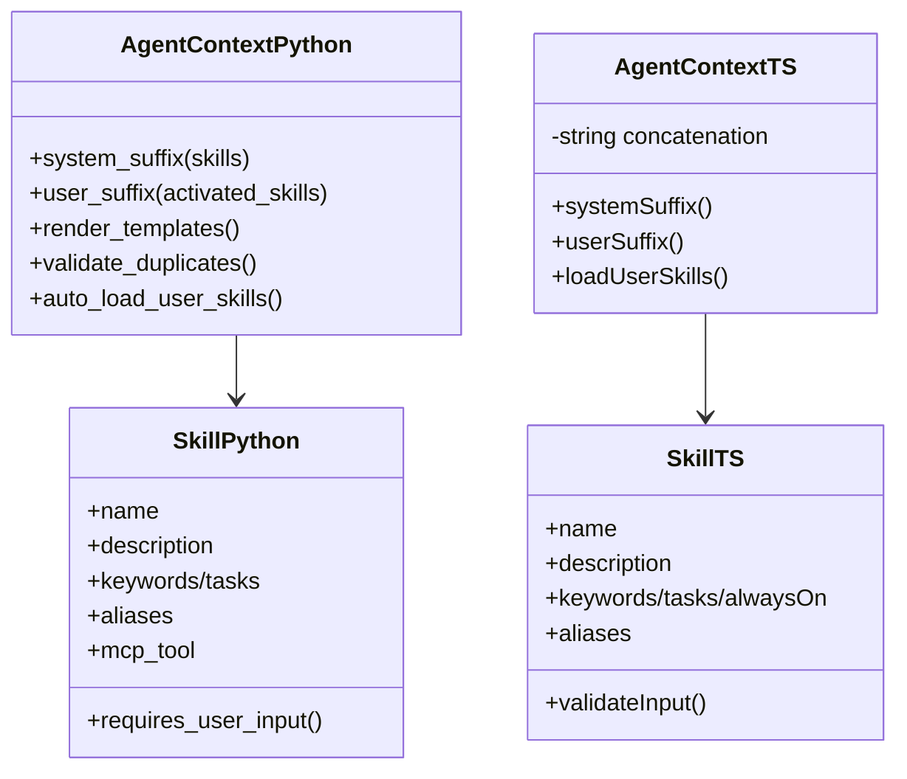
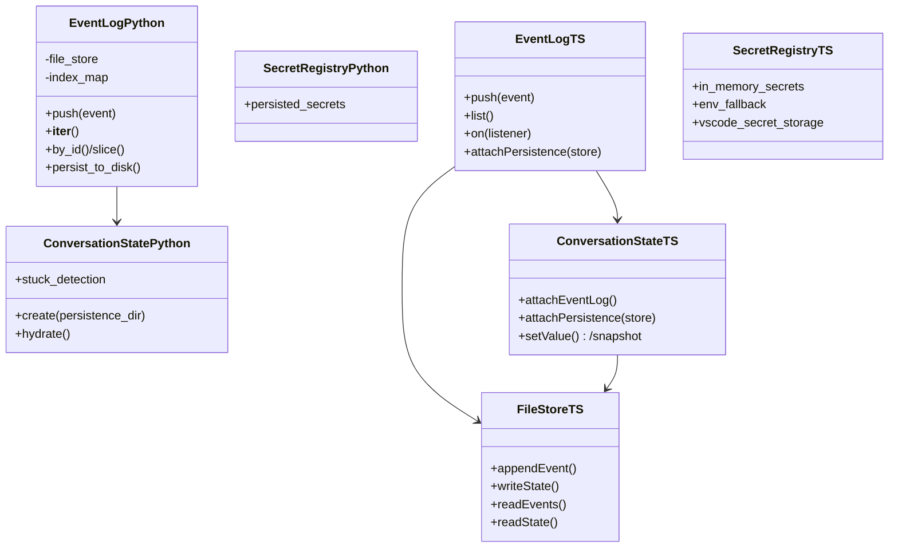

# Python ↔︎ TypeScript SDK parity guide

This document compares the Python `agent-sdk` (reference implementation) with the TypeScript `@openhands/agent-sdk-ts` (VS Code-focused SDK). It highlights where interfaces align, where behavior diverges, and what is missing for parity. Mermaid diagrams summarize key classes and relationships in each layer.

## Audit scope (oh-tab-0rq)

This document is the living output for Beads issue `oh-tab-0rq`.

- TypeScript SDK: `packages/agent-sdk-ts` (this repo).
- Python reference SDK: `~/repos/agent-sdk` (OpenHands/software-agent-sdk).
- Focus: VS Code local-mode parity (no agent-server / remote workspace).

## Current parity snapshot (2025-12-16)

This section summarizes concrete behavior alignment between Python agent-sdk and TypeScript @openhands/agent-sdk-ts observed today, with pointers to code/tests and gaps to close.

- Tool error messages (MessageEvent with role="tool")
  - Python: events_to_messages converts AgentErrorEvent to a tool Message with plain text error content. No JSON encoding. See tests/sdk/event/test_events_to_messages.py::test_agent_error_event.
  - TypeScript: createToolCallErrorEvents emits a tool MessageEvent with plain text error content (not JSON). See src/sdk/runtime/toolCallErrorEvents.ts.
  - Truncation: TS caps error text at 4096 chars and appends " (truncated)"; Python does not enforce a 4096 cap in conversion (viewer utilities may truncate for display). Status: content format aligned (plain text); truncation policy diverges.

- Tool-call argument redaction (llm_tool_call_raw and logs)
  - Python: Secrets masking is applied to tool observations (e.g., Terminal) via SecretRegistry.mask_secrets_in_output; broader recursive argument redaction is not centrally enforced for tool-call argument logging.
  - TypeScript: Agent redacts recursively with heuristics, masking known keys (apiKey, token, password, client_secret, etc.) to "***" and masking Authorization: Bearer tokens in strings. See src/sdk/runtime/Agent.ts redactObject/redactStringHeuristics and tests: `Agent.redaction.test.ts` and `Agent.tool-call-redaction.test.ts`.
  - Status: TS adds stronger argument redaction for logs; Python focuses on observation output masking. Parity gap: centralized recursive argument redaction in Python or aligned policy documentation.

- security_risk on ActionEvent
  - Python: ActionEvent always has security_risk (defaults to UNKNOWN if omitted). See tests/cross/test_remote_conversation_live_server.py and tests/sdk/agent/test_extract_security_risk.py.
  - TypeScript: security_risk is optional; parseToolArgs pops security_risk from arguments and returns undefined when missing/invalid. See src/sdk/runtime/Agent.ts parseToolArgs/parseSecurityRisk and tests: `Agent.security-risk.test.ts`.
  - Status: Divergence. Consider adding defaulting to UNKNOWN in TS when integrating with agent-server, or clearly documenting optionality in TS-only flows.

- tool_call_id propagation
  - Python: tool_call_id is preserved across ActionEvent, ObservationEvent, AgentErrorEvent, and tool MessageEvent. See tests/sdk/event/test_events_to_messages.py and cross tests.
  - TypeScript: tool_call_id is populated consistently in ActionEvent/ObservationEvent and in error/tool messages. See src/sdk/runtime/Agent.ts and toolCallErrorEvents.ts and tests: `Agent.tool-errors.test.ts`.
  - Status: Aligned.

- AgentErrorEvent shape
  - Python: includes error (text), tool_name, tool_call_id. See tests/sdk/event/test_event_serialization.py and test_events_to_messages.py.
  - TypeScript: same fields present. See src/sdk/types/index.ts and toolCallErrorEvents.ts. Status: Aligned.

- Message roles and conversion
  - Python: LLMConvertibleEvent.events_to_messages builds system/user/assistant/tool messages; tool responses set role="tool" and include tool_call_id/name; agent errors become role="tool" messages with the error text. See tests/sdk/event/test_events_to_messages.py.
  - TypeScript: Agent pushes MessageEvents with role="tool" for observations and errors; assistant messages carry tool_calls; schemas mirror Python. See src/sdk/runtime/Agent.ts and tests.
  - Status: Aligned for core paths used by VS Code extension.

- Persistence and EventLog
  - Python: File-backed EventLog, deterministic IDs, resume-from-disk via ConversationState.create, FIFO locks, etc.
  - TypeScript: FileStore-backed persistence exists (events + state) and LocalConversation supports restore. See `packages/agent-sdk-ts/src/sdk/runtime/FileStore.ts` and tests: `packages/agent-sdk-ts/src/sdk/__tests__/persistence.test.ts`.

- Tool observation content (role="tool" messages)
  - Python: tool observations are LLM-facing plain text via Observation helpers (e.g., TerminalObservation appends metadata and uses `<response clipped>` truncation). See `tests/tools/terminal/test_observation_truncation.py`.
  - TypeScript: Agent currently JSON-stringifies tool results into tool MessageEvent content (AgentErrorEvent tool messages are plain text). See `packages/agent-sdk-ts/src/sdk/runtime/Agent.ts` (executeTool) and `packages/agent-sdk-ts/src/sdk/runtime/toolCallErrorEvents.ts`.
  - Status: Divergence; affects LLM context quality and parity with Python tests/spec.

- Terminal session semantics
  - Python: persistent shell session; supports `is_input` (stdin/log polling) and `reset`. See `tests/tools/terminal/test_terminal_session.py`.
  - TypeScript: per-command child process; `is_input` returns an unsupported message and `reset` is currently ignored. See `packages/agent-sdk-ts/src/tools/TerminalTool.ts` and `packages/agent-sdk-ts/src/tools/IntegratedTerminalRunner.ts`.
  - Status: Divergence; impacts common VS Code workflows (env vars, venv activation, cwd persistence).

Actionable gaps to consider next
- Decide on unified error text truncation policy (keep TS 4096 cap or match Python behavior). If keeping TS cap, document rationale and ensure consumers expect plain text possibly truncated.
- Define cross-SDK policy for tool-call argument redaction; either port TS recursive redaction to Python (central helper) or scope TS to observation-only to match Python. Document effective guarantees for logs/telemetry.
- security_risk defaulting: consider default UNKNOWN in TS when interoperating with agent-server to match Python expectations; otherwise ensure server tolerates undefined in TS-local contexts.
- Tool observation formatting: move away from JSON-only tool messages toward Python-like, human-readable tool outputs with consistent truncation + (optional) metadata.
- TerminalTool: implement persistent session semantics (or change schema/description to match reality) and add tests mirroring Python.
- FileEditorTool: add `undo_edit` parity and tighten directory/binary viewing behavior.
- Longer term (out of scope for VS Code local mode): remote workspace and agent-server-only behaviors.

## Candidate test cases to mirror (from `~/repos/agent-sdk`)

These Python tests are the most directly relevant “spec” for VS Code local-mode parity work. Use them to drive new Vitest coverage in `packages/agent-sdk-ts` (tests first, then implementation).

### Terminal tool

- Python: `tests/tools/terminal/test_terminal_tool.py` (basic execution, schema) → TypeScript: `packages/agent-sdk-ts/src/tools/__tests__/tools.test.ts` (expand coverage).
- Python: `tests/tools/terminal/test_observation_truncation.py` (LLM-facing output formatting + `<response clipped>`) → TypeScript: add parity tests around `Agent` tool message content/truncation.
- Python: `tests/tools/terminal/test_terminal_session.py`, `tests/tools/terminal/test_shutdown_handling.py`, `tests/tools/terminal/test_shell_path_configuration.py` → TypeScript: missing (requires persistent session + reset/is_input semantics).
- Python: `tests/tools/terminal/test_secrets_masking.py` → TypeScript: missing (SecretRegistry-aware masking for tool output).

### File editor tool

- Python: `tests/tools/file_editor/test_basic_operations.py` (create/view/str_replace/insert/undo_edit) → TypeScript: partial in `packages/agent-sdk-ts/src/tools/__tests__/tools.test.ts` (add undo_edit + error cases).
- Python: `tests/tools/file_editor/test_schema.py` (command enum includes undo_edit) → TypeScript: update schema once undo_edit is implemented.
- Python: `tests/tools/file_editor/test_workspace_root.py`, `tests/tools/file_editor/test_file_validation.py`, `tests/tools/file_editor/test_view_supported_binary_files.py` → TypeScript: missing (directory view rules + binary handling).

### Glob/Grep tools

- Python: `tests/tools/glob/test_glob_tool.py`, `tests/tools/glob/test_consistency.py` → TypeScript: add fixtures to cover ignore rules, ordering, and truncation behavior.
- Python: `tests/tools/grep/test_grep_tool.py`, `tests/tools/grep/test_consistency.py` → TypeScript: add fixtures to cover include globs + regex semantics and truncation behavior.

### Runtime/events/workspace

- Python: `tests/sdk/event/test_events_to_messages.py`, `tests/sdk/event/test_event_serialization.py` → TypeScript: `packages/agent-sdk-ts/src/sdk/__tests__/agent-sdk.guards.test.ts` + runtime tests (expand into message conversion parity).
- Python: `tests/sdk/security/test_confirmation_policy.py` → TypeScript: `packages/agent-sdk-ts/src/sdk/__tests__/agent.loop.test.ts` and `packages/agent-sdk-ts/src/sdk/runtime/__tests__/Agent.security-risk.test.ts`.
- Python: `tests/sdk/io/test_local_filestore_security.py` → TypeScript: `packages/agent-sdk-ts/src/workspace/__tests__/local.workspace.test.ts` (expand with symlink cases).

## Beads follow-ups (created from this audit)

- `oh-tab-wmn` — agent-sdk-ts: TerminalTool persistent session + is_input/reset parity
- `oh-tab-bcu` — agent-sdk-ts: Tool MessageEvent content parity (avoid JSON-only tool outputs)
- `oh-tab-nbc` — agent-sdk-ts: FileEditorTool undo_edit parity
- `oh-tab-7d4` — agent-sdk-ts: FileEditorTool directory view + binary handling parity
- `oh-tab-pla` — agent-sdk-ts: LocalWorkspace symlink/path security parity
- `oh-tab-2wx` — agent-sdk-ts: GlobTool/GrepTool parity (fixtures, ignore, truncation)

## Workspace layer

### Python shape

- Factory `Workspace()`
  - Returns `LocalWorkspace` or `RemoteWorkspace` based on `host`/`api_key`
  - Shares `BaseWorkspace` with `working_dir`, context-manager support, and discriminated union typing
- `LocalWorkspace`
  - Command execution with timeout/error metadata
  - Git change/diff helpers
  - Upload/download/copy operations
  - Strict path validation
- `RemoteWorkspace`
  - Wraps HTTP endpoints for commands, file transfer, and git metadata
  - Mirrors `CommandResult`/`FileOperationResult` schemas
  - Queue-based locking

### TypeScript shape

- Only `LocalWorkspace` exists
  - Resolves workspace root
  - Reads/writes/removes files
  - Creates directories
  - Runs commands via VS Code APIs with minimal metadata
- No shared base class or factory
- No remote workspace or file transfer helpers

### Gaps to close

- Add workspace factory + base abstraction with `working_dir`, context manager/cleanup semantics, and discriminated typing for local vs remote
- Port upload/download/copy helpers, git change/diff models, and richer `CommandResult` fields (timeout, stderr segmentation)
- Implement remote workspace with HTTP-backed command lifecycle and path validation parity

### Source references
- Python: openhands/sdk/workspace/base.py BaseWorkspace; openhands/sdk/workspace/local.py LocalWorkspace; openhands/sdk/workspace/remote/base.py RemoteWorkspace; openhands/sdk/workspace/remote/remote_workspace_mixin.py RemoteWorkspaceMixin.
- TypeScript: packages/agent-sdk-ts/src/workspace/LocalWorkspace.ts LocalWorkspace.

## Conversation layer

### Python shape

- Factory `Conversation()`
  - Chooses `LocalConversation` vs `RemoteConversation` based on workspace type
  - Passes `persistence_dir`, `conversation_id`, callback stack, `max_iteration_per_run`, stuck detection toggle, visualizer implementation, and secrets
- `LocalConversation`
  - Runs the `Agent` loop
  - Persists events/state
  - Supports resume-from-disk
  - Exposes context-manager cleanup
- `RemoteConversation`
  - Prohibits persistence dir
  - Relays messages over HTTP/WebSocket
  - Mirrors confirmation/status callbacks
  - Replays history from the agent server

### TypeScript shape

- `Conversation()`
  - Selects `LocalConversation` (in-process) or `RemoteConversation` (WebSocket with HTTP history replay) based on `serverUrl` presence
- `LocalConversation`
  - Builds fresh `Agent`, `EventLog`, `ConversationState`, and `SecretRegistry`
  - Emits `status/event/error/conversationStarted/terminal`
  - Has no persistence or cleanup hooks
- `RemoteConversation`
  - Manages reconnect/replay and exposes settings mutation
  - Only proxies chat/events (no remote workspace/file helpers)

### Gaps to close

- Persistence-aware construction (resume from disk, persistence directory validation) and context-manager cleanup
- Visualizer/stuck-detection hooks, richer callback chaining, and secret injection aligned with Python's constructor signature
- Remote workspace-aware commands, git/file helpers, and HTTP fallback parity (TS remote mode only streams chat/events)

### Source references
- Python: openhands/sdk/conversation/conversation.py Conversation; openhands/sdk/conversation/base.py BaseConversation, ConversationStateProtocol; openhands/sdk/conversation/impl/local_conversation.py LocalConversation; openhands/sdk/conversation/impl/remote_conversation.py RemoteConversation; openhands/sdk/conversation/state.py ConversationState.
- TypeScript: packages/agent-sdk-ts/src/sdk/conversation/index.ts Conversation factory; packages/agent-sdk-ts/src/sdk/conversation/LocalConversation.ts LocalConversation; packages/agent-sdk-ts/src/sdk/conversation/RemoteConversation.ts RemoteConversation; packages/agent-sdk-ts/src/sdk/runtime/ConversationState.ts ConversationState.

## Agent lifecycle and orchestration

### Python shape

- `Agent` extends `AgentBase`
  - Injects system prompt with serialized tool schemas
  - Enforces confirmation/security via analyzers
  - Supports condenser pipelines plus observability hooks
- Drives `_step` loop
  - Deduplication
  - Condensed event windows
  - Dual LLM APIs (responses vs completions)
  - Pending-action replay with disk-backed `ConversationState`
- Integrates with `SecretRegistry` persistence, stuck detection, and configurable confirmation policies

### TypeScript shape

- `Agent` wraps `AgentOrchestrator`
  - Builds/attaches `EventLog`, `ConversationState`, `SecretRegistry`
  - Optional tools/LLM client and optional `AgentContext`
- Methods: `run`, `pause/resume`, `cancel`, `approveAction/rejectAction`
  - Enforces iteration cap
  - Confirmation policy enum
  - Executes tool calls with basic error handling
- No condenser, security analyzer, or persisted state replay
- Confirmation logic is minimal and local-only

### Gaps to close

- Add tool schema/security analyzer injection, condenser pipeline, and observability hooks around `runLoop`
- Support persisted `ConversationState` restoration and pending-action replay
- Implement responses-API parity and richer confirmation policies akin to Python analyzers

### Source references
- Python: openhands/sdk/agent/base.py AgentBase; openhands/sdk/agent/agent.py Agent; openhands/sdk/conversation/state.py ConversationState; openhands/sdk/conversation/conversation.py Conversation factory glue.
- TypeScript: packages/agent-sdk-ts/src/sdk/runtime/Agent.ts Agent; packages/agent-sdk-ts/src/sdk/runtime/AgentOrchestrator.ts AgentOrchestrator; packages/agent-sdk-ts/src/sdk/runtime/ConversationState.ts ConversationState; packages/agent-sdk-ts/src/sdk/runtime/SecretRegistry.ts SecretRegistry.

## AgentContext and skills

### Python AgentContext

- Pydantic model with repo-skill templating
  - Uses `system_message_suffix.j2` templates
  - Triggered knowledge rendering
  - Duplicate detection
  - Auto-loading of user skills with warnings
  - Structured metadata
- Produces both system and user suffixes
  - Templated variables
  - Activation tracking

### TypeScript AgentContext

- Lightweight class that concatenates always-on skills into Markdown
  - Appends optional suffix
  - Matches triggers via substring search
  - Logs warnings for duplicates
- Skill activation tracking is minimal
- Formatting is plain strings (no templating)

### Skill models

- **Python `Skill`**
  - Pydantic validation
  - Keyword/task triggers
  - Auto `/name` trigger for task skills
  - MCP tool metadata
## Tool and event parity

### Python tool architecture

In Python, tools are modeled as `ToolDefinition[ActionT, ObservationT]` with a few key components:

- `Action` and `Observation` are Pydantic models (see `openhands.sdk.tool.schema`) that define the structured input/output for a tool.
- A `ToolDefinition` instance carries:
  - `name`, `description`, `annotations`, `meta`
  - `action_type` and `observation_type` (the concrete `Action`/`Observation` subclasses)
  - a runtime-only `executor: ToolExecutor[ActionT, ObservationT] | None` which performs the side effects
- `ToolExecutor.__call__(self, action: ActionT, conversation: LocalConversation | None) -> ObservationT` is responsible for executing the tool logic. For example, the Terminal tool uses an executor that runs shell commands in the workspace and returns an `ExecuteBashObservation`.
- The `Agent` never calls tools directly with raw args. Instead, the flow is:
  1. LLM produces a tool call (function name + JSON arguments).
  2. `_get_action_event` parses/validates arguments into an `Action` instance (e.g., `ExecuteBashAction`) and emits an `ActionEvent`.
  3. `_execute_action_event` looks up the corresponding `ToolDefinition`, invokes its `executor(action, conversation)`, and receives an `Observation`.
  4. The `Observation` is wrapped in an `ObservationEvent` and appended to the conversation.
- The `ConversationState` ties everything together by tracking events (including `ActionEvent`/`ObservationEvent`) and execution status.

### TypeScript tool architecture today

In TypeScript, the core tool abstraction is `ToolDefinition<TArgs, TResult>` (see `src/sdk/types/tools.ts`):

- `ToolDefinition` defines:
  - `name`, optional `description` and `parameters` (for schema)
  - `validate(input: unknown): TArgs` to coerce LLM arguments into a concrete args object
  - `execute(args: TArgs, context: ToolContext): Promise<TResult>` which performs the side effects and returns a result
  - an optional `getToolDefinition()` to expose an LLM-facing tool schema (`LLMToolDefinition`).
- Tools like `TerminalTool`, `FileEditorTool`, etc. currently implement `execute()` directly and return a simple result object (`TerminalResult`, `FileEditorResult`, ...). There are no explicit `Action`/`Observation` classes.
- The `Agent` loop (`src/sdk/runtime/Agent.ts`) handles tool calls by:
  1. Parsing `tool_call.arguments` as JSON.
  2. Validating arguments via `tool.validate()`.
  3. Emitting an `ActionEvent` (using the validated args as a plain record, not a typed `Action` subclass).
  4. Executing `tool.execute(args, context)` once confirmation policy allows.
  5. Wrapping the returned result in an `ObservationEvent` where `observation` is a plain JSON object.
- Event interfaces in `src/sdk/types/index.ts` mirror the Python wire format: `ActionEvent` and `ObservationEvent` are present, but they carry raw records (`Record<string, unknown>`) instead of strongly-typed `Action`/`Observation` models.

### Gaps and intended direction

- The TS runtime currently has **ActionEvent/ObservationEvent types but no first-class Action/Observation classes**. The Python stack uses Pydantic models for validation, kind resolution, and serialization; TS simply forwards validated args/results as plain JSON.
- There is no `ToolDefinition`/`ToolExecutor` split in TS. `ToolDefinition.execute` is both the definition and executor. This is enough for VS Code usage but diverges from Python, where the executor can be swapped or wrapped (e.g., for remote execution, observability, or sandboxing).
- The Python Agent works in terms of `ActionEvent`→`ToolExecutor`→`ObservationEvent`. TS mirrors the **event shapes** but shortcuts the intermediate typed models.

**Practical parity goal for now:**

Rather than fully re-implementing Pydantic-style action/observation classes in TS, the near-term goal is:

- Keep the event wire format aligned (ActionEvent/ObservationEvent shapes stay compatible with Python).
- Ensure each tool has a well-defined input/result schema and that the Agent loop always:
  - emits an `ActionEvent` when the LLM calls a tool;
  - executes the corresponding tool;
  - emits an `ObservationEvent` with the structured result.

`TerminalTool` is the first place where we validate this end-to-end behavior for a “real” environment-interacting tool.

  - Input validation helpers (`requires_user_input`)
  - Third-party aliasing
- **TypeScript `Skill`**
  - Mirrors keyword/task/always-on triggers
  - Aliasing and missing-variable prompts
  - Lacks MCP tool metadata
  - No schema validation
  - No regex triggers

### Gaps to close

- Introduce template-driven rendering for system/user suffixes and richer trigger matching (regex, keyword weighting)
- Add MCP tool metadata, schema validation, and structured activation logs to TypeScript skills

### Source references
- Python: openhands/sdk/context/agent_context.py AgentContext; openhands/sdk/context/skills/skill.py Skill; openhands/sdk/context/skills/types.py SkillKnowledge, SkillResponse, SkillContentResponse.
- TypeScript: packages/agent-sdk-ts/src/sdk/context/agent-context.ts AgentContext; packages/agent-sdk-ts/src/sdk/context/skills/skill.ts Skill, SkillValidationError.

## Event logging, persistence, and events

### EventLog/persistence

- **Python `EventLog`**
  - File-backed with deterministic filenames/indices
  - Duplicate-ID detection
  - Slicing/iteration helpers
  - Integration with:
    - `EventsListBase`: iteration and index helpers
    - `persistence_const`: directory and filename patterns
    - `serialization_diff`: state diffing
    - FIFO locks: cross-process locking
  - `ConversationState.create`: hydrates state (iteration counts, stuck detection) from disk
  - `SecretRegistry`: persists secrets
- **TypeScript `EventLog`**
  - In-memory only
  - Normalizes IDs/timestamps
  - Broadcasts listeners
  - Supports `push/list/on`
  - `ConversationState`: in-memory with optional `attachEventLog`
  - `SecretRegistry`: non-persisted

### Gaps to close

- Add file-backed storage with deterministic naming/indexing and duplicate protection
- Port persistence constants, diffing, and cross-process locks
- Persist secrets and conversation state for resume/replay

## Tool schema parity

- Introduced zod-backed tool definitions for `browser_use`, `delegate`, `glob`, `grep`, and `planning_file_editor` so the TypeScript
  SDK mirrors the Python tool descriptions and annotations. Structured tools now surface JSON Schema parameters in the system
  prompt to keep VS Code behavior aligned with the reference SDK.
- Expose hydration helpers mirroring Python's `ConversationState.create`

### Event interface coverage

- **Python event classes** (Pydantic models in `openhands.sdk.event`):
  - A suite of event classes including:
    - `SystemPromptEvent`
    - `ActionEvent`
    - `ObservationEvent`
    - `UserRejectObservation`
    - `MessageEvent`
    - `AgentErrorEvent`
    - `ConversationErrorEvent`
    - `TokenEvent`
    - `PauseEvent`
    - `Condensation`
    - `CondensationRequest`
    - `CondensationSummaryEvent`
    - `ConversationStateUpdateEvent`
  - All events extend `Event`/`LLMConvertibleEvent`
  - Include fields: `id`, `timestamp`, `source`, and type-specific data (tool call IDs, reasoning, summaries)
- **TypeScript event interfaces** (`src/sdk/types`):
  - Mirrors most Python events using discriminated `kind` property:
    - `SystemPromptEvent`
    - `ActionEvent`
    - `ObservationEvent`
    - `UserRejectObservation`
    - `MessageEvent`
    - `AgentErrorEvent`
    - `ConversationErrorEvent`
    - `PauseEvent`
    - `Condensation`
    - `ConversationStateUpdateEvent`
  - Lacks:
    - `TokenEvent`
    - Condensation request/summary variants
  - Metadata fields are narrower (e.g., no stuck-detection or condenser fields)

### Source references
- Python: openhands/sdk/conversation/event_store.py EventLog; openhands/sdk/conversation/state.py ConversationState; openhands/sdk/conversation/persistence_const.py persistence constants; openhands/sdk/event/types.py event discriminators; openhands/sdk/event/conversation_state.py ConversationStateUpdateEvent; openhands/sdk/event/conversation_error.py ConversationErrorEvent; openhands/sdk/event/token.py TokenEvent; openhands/sdk/event/user_action.py ActionEvent/UserRejectObservation; openhands/sdk/event/condenser.py condensation events; openhands/sdk/event/base.py Event/LLMConvertibleEvent.
- TypeScript: packages/agent-sdk-ts/src/sdk/runtime/EventLog.ts EventLog; packages/agent-sdk-ts/src/sdk/runtime/ConversationState.ts ConversationState; packages/agent-sdk-ts/src/sdk/runtime/SecretRegistry.ts SecretRegistry; packages/agent-sdk-ts/src/sdk/types/index.ts SystemPromptEvent, MessageEvent, ActionEvent, ObservationEvent, ConversationStateUpdateEvent, ConversationErrorEvent, PauseEvent, Condensation, is* guards.

## Quick checklist for parity work
- Implement workspace factory/base with remote support, path validation, git helpers, and richer command metadata.
- Extend conversations with visualizer/stuck-detection hooks, callback stacks, and remote workspace helpers.
- Augment agent with condenser/security analyzers, persisted state replay, and expanded confirmation policies.
- Add template-aware `AgentContext`, MCP-aware `Skill` metadata/validation, and richer trigger matching.
- Align tool message formatting (Terminal/FileEditor) with Python’s LLM-facing observations (truncation markers, optional metadata, secrets masking).
- Add missing event variants (`TokenEvent`, condensation request/summary) if VS Code needs them for UI parity.
