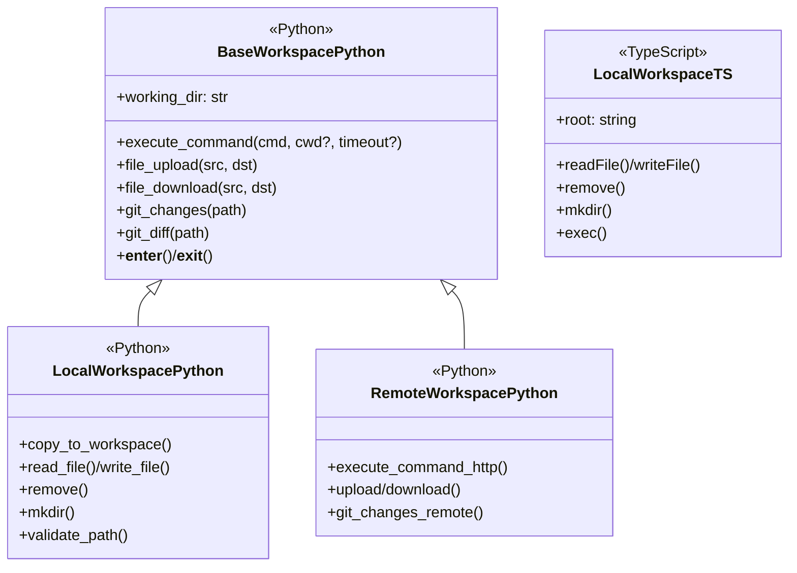
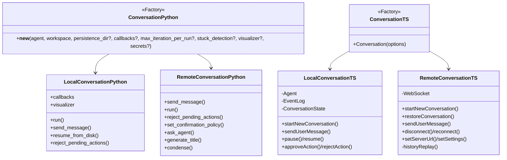
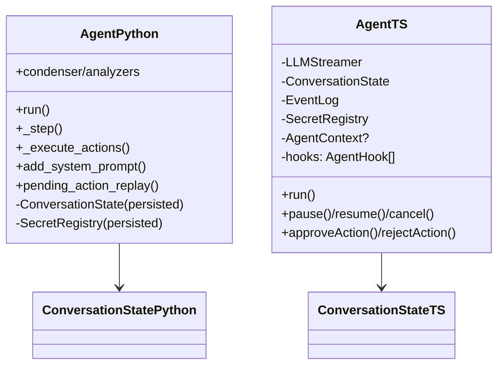
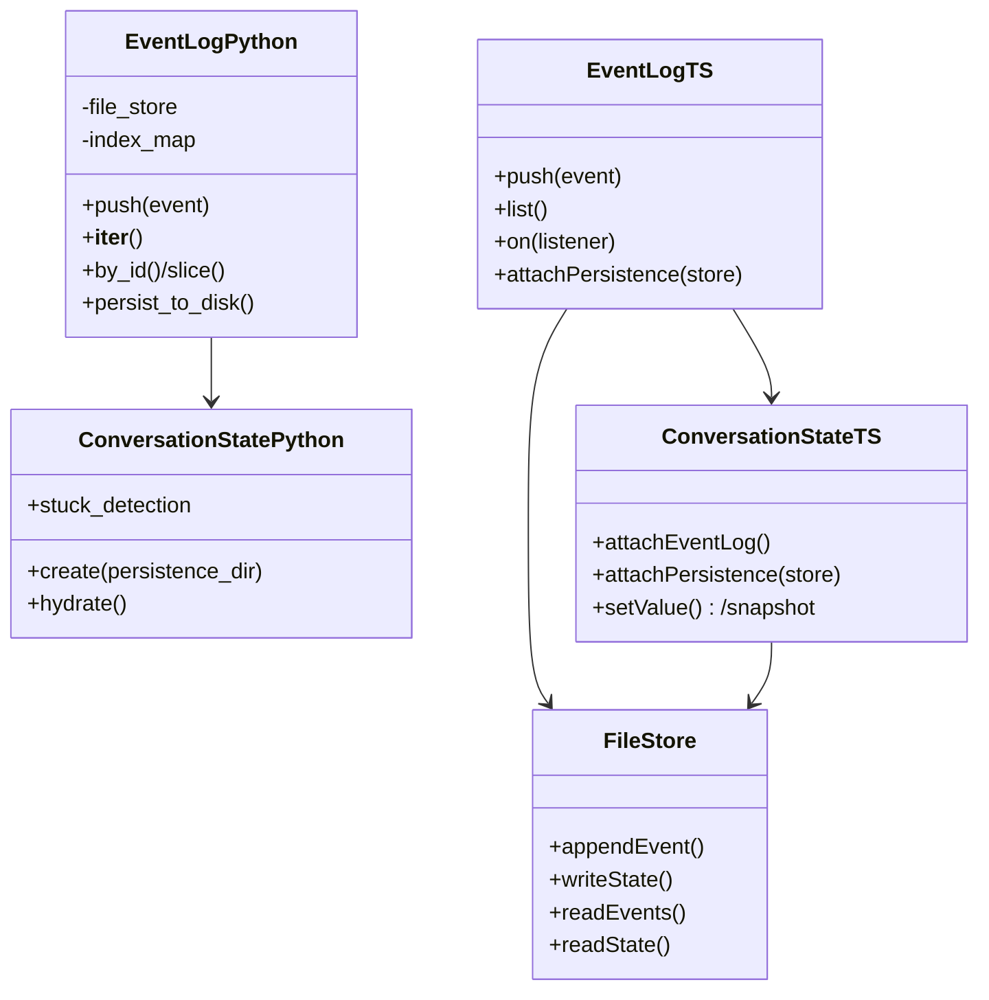

# Python ↔︎ TypeScript SDK parity guide

This document compares the Python `agent-sdk` (reference implementation) with the TypeScript `@openhands/agent-sdk-ts` (VS Code-focused SDK). Note that agent-sdk-ts is basically a transpilation of the Python agent-sdk. It highlights where interfaces align, where behavior diverges, and what is missing for parity. Mermaid diagrams summarize key classes and relationships in each layer.

## Audit scope (oh-tab-0rq)

This document is the living output for Beads issue `oh-tab-0rq`.

- TypeScript SDK: `packages/agent-sdk-ts` (this repo).
- Python reference SDK: `~/repos/agent-sdk` ([OpenHands/software-agent-sdk](https://github.com/OpenHands/software-agent-sdk)).
- Focus: VS Code local-mode parity and remote conversation working correctly (no agent-server implementation in TS).

## How to re-run this audit

1. Clone both repos:

   - This repo: `enyst/OpenHands-Tab` (folder: `packages/agent-sdk-ts`)
   - Upstream: `OpenHands/software-agent-sdk`

2. Record the upstream ref/commit you audited against in this doc.

   - Last audited against upstream commit: `6a004a1d53d30fe09d9812753a57c69ec0a32036` (2026-01-14)

3. Compare the wire-format and runtime behavior (not just types):

   - Events → LLM messages: Python `openhands-sdk/openhands/sdk/event/llm_convertible/*` vs TS `packages/agent-sdk-ts/src/sdk/runtime/*`
   - Tool schemas + validation: Python `openhands-sdk/openhands/sdk/tool/*` vs TS `packages/agent-sdk-ts/src/sdk/tools/*`
   - Conversation persistence + resume: Python `openhands-sdk/openhands/sdk/conversation/*` vs TS `packages/agent-sdk-ts/src/sdk/conversation/*`

4. Run TS SDK unit tests before/after changes:

   ```bash
   npm install
   npm test -w @openhands/agent-sdk-ts
   ```


## Module structure overview

Quick reference for module-level parity between Python and TypeScript SDKs.

| Module | Python | TypeScript | Notes |
|--------|--------|-----------|-------|
| agent/ | ✓ `Agent`, `AgentBase` | ✓ `Agent` in runtime/ | TS has separate `LLMStreamer` |
| context/ | ✓ | ✓ | Similar skill/context handling |
| conversation/ | ✓ | ✓ | Both have Local/Remote variants |
| critic/ | ✓ | ✗ | Evaluation framework, Python only (not planned) |
| event/ | ✓ | ✓ types/ | Different patterns (class vs interface) |
| git/ | ✓ | ✗ | Full git utilities, Python only (not planned) |
| hooks/ | ✓ full | ✓ partial | Python: config-driven + executor; TS: inline interface only |
| io/ | ✓ `FileStore` | ✓ `FileStore` | Both have persistence support |
| llm/ | ✓ LiteLLM | ✓ native | Different approaches (LiteLLM vs native providers) |
| logger/ | ✓ Rich/JSON | ✗ | Comprehensive logging, Python only (not planned) |
| mcp/ | ✓ full | ✓ config only | Python has MCPClient; TS only parses .mcp.json for skills |
| observability/ | ✓ Laminar/OTEL | ✗ | Telemetry, Python only (not planned) |
| secret/ | ✓ | ✓ runtime/ | TS has `SecretRegistry` in runtime |
| security/ | ✓ module | ✓ inline + module | Python has separate module; TS has inline + security/ |
| tool/ | ✓ | ✓ tools/ | Different validation approaches (Pydantic vs Zod) |
| workspace/ | ✓ | ✓ | Python has more complete remote support |

## Features comparison (2026-01-13)

### Features in Python but NOT in TypeScript

1. **Hooks System - Config-driven execution**
   - Python: Full `HookManager` with `HookConfig` loading from `.openhands/hooks.json`, `HookExecutor` with subprocess execution, pattern matching (wildcard/regex), decision blocking (ALLOW/DENY), environment variable injection
   - TypeScript: `AgentHook` interface with `beforeToolCall`, `afterToolCall`, `afterEvent`, `shouldStop` - inline implementation only, no config file support, no subprocess execution
   - **Status**: TS has basic hook interface; missing config loading, subprocess executor, and pattern matching

2. **MCP Client for tool execution**
   - Python: Full `MCPClient` (fastmcp-based) with `MCPToolExecutor`, dynamic action/observation types, async/sync bridge
   - TypeScript: Only `.mcp.json` config parsing/validation with variable expansion for skills; no MCPClient for tool execution
   - **Status**: TS can parse MCP configs but cannot execute MCP tools

3. **Critic Module** - `CriticBase`, `AgentFinishedCritic`, `EmptyPatchCritic`, `PassCritic` (not planned)

4. **Git Module** - `GitDiff`, `GitChanges`, `GitManager` (not planned)

5. **Observability Module** - Laminar integration, OpenTelemetry, `@observe` decorator (not planned)

6. **Logger Module** - Rich console logging, JSON logging, rotating file handlers (not planned)

7. **Tom Consult Tools** - `ConsultTomTool`, `SleeptimeComputeTool` for user modeling/personalization (not planned)

8. **Plugins + custom tool loading** - plugin data model, directory loading, and remote custom tools support

9. **RemoteConversation extended API**
   - Python: `set_confirmation_policy()`, `set_security_analyzer()`, `update_secrets()`, `ask_agent()` (stateless question), `generate_title()`, `condense()` (force condensation)
   - TypeScript: `setServerUrl()`, `setSettings()`, `reconnect()` (TS-only dynamic features)
   - **Status**: Different feature sets; TS has dynamic URL/settings mutation, Python has more server-side control

10. **Public skills repo loading** (`load_public_skills`)
    - Python: Can load skills from external OpenHands/skills repository
    - TypeScript: Only local skill loading

### Features in TypeScript but NOT in Python

1. **LLM Profiles System** - Profile-based provider management in `~/.openhands/llm-profiles/` (JSON), validation, profiles-first config approach

2. **Native LLM Clients** - Direct Anthropic, OpenAI, OpenAI Responses (gpt-5), Gemini clients without LiteLLM dependency

3. **LLM Router + Fallback** - Generic router interface with `createRouterLlmClient()` and `createFallbackLlmClient()` with error-based switching

4. **Tool Summarization** - Gemini Flash-based summarization for large tool outputs (`toolSummarizer.ts`, `fileDiffSummarizer.ts`, `terminalObservationSummarizer.ts`, `gitChangeSummarizer.ts`)

5. **AskOracleTool** - Delegates questions to a configurable oracle LLM profile

6. **BrowserTool (HTTP)** - Simple HTTP/HTTPS fetch tool (separate from BrowserUseTool automation)

7. **IntegratedTerminalRunner** - VS Code pseudoterminal integration with spawn fallback

8. **LLM Client Caching** - `LlmClientCache` for reusing LLMStreamer instances per profile

### Cross-cutting differences

| Aspect | Python | TypeScript |
|--------|--------|-----------|
| Event pattern | Class inheritance | Discriminated union interfaces |
| Event discriminator | Class name / `isinstance()` | `kind` field string |
| Validation | Pydantic models | Zod schemas |
| LLM abstraction | LiteLLM (provider agnostic) | Native provider clients |
| Async handling | Sync-first with optional async | Async-first (Promise-based) |
| Execution status | `ConversationExecutionStatus` enum | String literals |
| Tool registration | `register_tool()` + registry | Direct tool instantiation |
| Observation formatting | `to_llm_content` property on class | External `observationToLLMText()` function |

## Tool comparison (2026-01-13)

| Tool | Python | TypeScript | Parity Status |
|------|--------|-----------|---------------|
| **terminal** | Full: tmux/subprocess backends, is_input, reset, timeout, metadata | Full: subprocess-based, is_input, reset, timeout | ✓ Aligned (TS lacks tmux) |
| **file_editor** | view/create/str_replace/insert/undo_edit, diff, image support | Same commands, undo_edit, image viewing | ✓ Aligned |
| **glob** | Pattern matching, 100 result limit, mtime sort | Same features | ✓ Aligned |
| **grep** | Regex search, include filter, 100 result limit | Same features | ✓ Aligned |
| **browser_use** | Full Chromium automation: navigate, click, type, scroll, tabs, storage, screenshots | Stubbed: all methods return placeholders | ⚠️ TS is stubbed only |
| **apply_patch** | Unified patch format, fuzzy matching, commit tracking | Same format, fuzzy matching | ✓ Aligned |
| **delegate** | spawn/delegate sub-agents, task assignment | Stubbed: returns mock completions | ⚠️ TS is stubbed only |
| **task_tracker** | TASKS.json management, view/plan commands | Same implementation | ✓ Aligned |
| **planning_file_editor** | Restricted to PLAN.md editing | Same restrictions | ✓ Aligned |
| **think** | Logging-only reasoning tool | Same implementation | ✓ Aligned (description matched) |
| **finish** | Task completion signal | Same implementation | ✓ Aligned |
| **tom_consult** | User modeling, RAG support | ✗ Not implemented | Python only (not planned) |
| **ask_oracle** | ✗ Not in Python | Delegates to oracle LLM | TS only |
| **browser (HTTP)** | ✗ Not in Python | Simple HTTP fetch | TS only |

## Current parity snapshot (2026-01-14)

### Tool error messages (MessageEvent with role="tool")
- Python: `AgentErrorEvent.to_llm_message()` emits a `role="tool"` message with plain text `error` content (no JSON encoding, no truncation).
  - Source: `openhands-sdk/openhands/sdk/event/llm_convertible/observation.py`
- TypeScript: `createToolCallErrorEvents()` emits a `MessageEvent` with `role="tool"` and plain text `error` content (no JSON encoding, no truncation).
  - Source: `packages/agent-sdk-ts/src/sdk/runtime/toolCallErrorEvents.ts`
- Note: non-error tool outputs are still truncated for LLM safety (shared `<response clipped>` marker) via `packages/agent-sdk-ts/src/sdk/runtime/toolResultTruncation.ts`.
- **Status**: Aligned.

### Tool-call argument redaction
- Python: Secrets masking via `SecretRegistry.mask_secrets_in_output` for tool observations.
- TypeScript: Agent redacts recursively with heuristics, masking known keys (apiKey, token, password, client_secret, etc.) to "***" and masking Authorization: Bearer tokens in strings.
- **Status**: TS adds stronger argument redaction for logs; Python focuses on observation output masking. This is acceptable.

### security_risk on ActionEvent
- Python: `ActionEvent` always has `security_risk` (defaults to UNKNOWN if omitted).
- TypeScript: `security_risk` is optional; `parseToolArgs` pops it from arguments and returns undefined when missing/invalid.
- **Status**: Divergence. Consider adding defaulting to UNKNOWN in TS when integrating with agent-server.

### ActionEvent metadata
- Python: `ActionEvent` includes `summary`, `thinking_blocks`, `responses_reasoning_item`.
- TypeScript: `ActionEvent` includes `thought`, `reasoning_content`, `thinking_blocks`, `responses_reasoning_item`; `summary` is not represented.
- **Status**:
  - `summary`: Not a TS parity gap for OpenHands-Tab (Gemini Flash generates summaries on the fly).
  - `thinking_blocks` and `responses_reasoning_item`: Aligned for parity/debuggability.

### Default LLM timeout
- Python: 300s default.
- TypeScript: 300_000ms (300s) default.
- **Status**: Aligned.

### include_default_tools option
- Python: `include_default_tools` to selectively include built-in tools.
- TypeScript: `includeDefaultTools?: boolean | string[]` to disable defaults or select a subset.
- **Status**: Aligned (API naming differs).

### AgentSkills (SKILL.md) + repo skill files
- Python: SKILL.md directories with strict naming, progressive disclosure (`to_prompt()` XML), resources, `.mcp.json` support, and optional public skills loading.
- TypeScript: SKILL.md directories with strict naming, `<available_skills>` progressive disclosure, resource discovery, `.mcp.json` parsing/validation with variable expansion, and third-party repo skill files (`.cursorrules`, `AGENTS.md`, `CLAUDE.md`, `GEMINI.md`) with truncation + vendor-family gating.
- **Status**: Parity largely aligned; remaining gap is public skills repo loading.

### tool_call_id propagation
- Python: `tool_call_id` preserved across ActionEvent, ObservationEvent, AgentErrorEvent, and tool MessageEvent.
- TypeScript: `tool_call_id` populated consistently in ActionEvent/ObservationEvent and in error/tool messages.
- **Status**: Aligned.

### AgentErrorEvent shape
- Python: includes error (text), tool_name, tool_call_id.
- TypeScript: same fields present.
- **Status**: Aligned.

### Message roles and conversion
- Python: `LLMConvertibleEvent.events_to_messages` builds system/user/assistant/tool messages.
- TypeScript: Agent pushes MessageEvents with appropriate roles; schemas mirror Python.
- **Status**: Aligned for core paths used by VS Code extension.

### Persistence and EventLog
- Python: File-backed EventLog, deterministic IDs, resume-from-disk via `ConversationState.create`, FIFO locks.
- TypeScript: `FileStore`-backed persistence exists (events JSONL + state JSON) and LocalConversation supports restore.
- **Status**: Aligned for VS Code local-mode usage.

### Terminal session semantics
- Python: Persistent shell session; supports `is_input` (stdin/log polling) and `reset`.
- TypeScript: Persistent session semantics (cwd/env persistence), `is_input`/`reset` support.
- **Status**: Aligned for VS Code local-mode usage.

### Stuck detection
- Python: `StuckDetector` in conversation module.
- TypeScript: `StuckDetector` class with configurable thresholds for actionObservation, actionError, monologue, alternatingPattern.
- **Status**: Aligned.

### ConversationVisualizer
- Python: `DefaultVisualizer` with Rich formatting for CLI output.
- TypeScript: `ConversationVisualizer` with markdown rendering, optional timestamps, skip options.
- **Status**: Aligned (different output formats: Rich vs Markdown).

### ConversationStats
- Python: `ConversationStats` for metrics aggregation.
- TypeScript: `ConversationStats` with serialization/restoration support.
- **Status**: Aligned.

## Hooks system comparison

### Python hooks (full implementation)

```python
# HookEventType enum
PRE_TOOL_USE     # Before tool execution
POST_TOOL_USE    # After tool execution
USER_PROMPT_SUBMIT # When user submits prompt
SESSION_START    # When conversation starts
SESSION_END      # When conversation ends
STOP             # Stop hook

# HookManager methods
run_pre_tool_use(tool_name, tool_input) -> (should_continue, results)
run_post_tool_use(tool_name, tool_input, tool_response) -> results
run_user_prompt_submit(message) -> (should_continue, additional_context, results)
run_session_start() -> results
run_session_end() -> results
run_stop(reason) -> (should_stop, results)

# Features
- Config loading from .openhands/hooks.json
- HookExecutor with subprocess execution
- Pattern matching (wildcard, exact, regex) for tool names
- HookResult with decision (ALLOW/DENY), reason, additional_context
- Environment variables: OPENHANDS_PROJECT_DIR, SESSION_ID, EVENT_TYPE, TOOL_NAME
```

### TypeScript hooks (interface only)

```typescript
interface AgentHook {
  beforeToolCall?: (params: BeforeToolCallHookParams) => BeforeToolCallHookResult | Promise<BeforeToolCallHookResult>;
  afterToolCall?: (params: AfterToolCallHookParams) => void | Promise<void>;
  afterEvent?: (params: AfterEventHookParams) => void | Promise<void>;
  shouldStop?: (params: ShouldStopHookParams) => boolean | Promise<boolean>;
}

// BeforeToolCallHookResult can return modified args
type BeforeToolCallHookResult = void | { args?: Record<string, unknown> };

// Features
- Inline implementation (no config file)
- Can modify tool args before execution
- Can halt agent via shouldStop
- Async-safe with Promise support
```

### Hooks parity gaps
- No config file loading (`.openhands/hooks.json`)
- No subprocess-based hook execution
- No pattern matching for tool names
- No USER_PROMPT_SUBMIT, SESSION_START, SESSION_END hooks
- No decision blocking with ALLOW/DENY
- No additional context injection

## LLM layer comparison

### Python LLM (LiteLLM-based)

```python
class LLM(BaseModel, RetryMixin, NonNativeToolCallingMixin):
    model: str  # Default: "claude-sonnet-4-20250514"
    api_key: str | SecretStr | None
    base_url: str | None
    timeout: int | None  # Default: 300s
    temperature: float | None
    max_input_tokens: int | None
    max_output_tokens: int | None
    stream: bool
    native_tool_calling: bool
    reasoning_effort: Literal["low", "medium", "high", "xhigh", "none"]
    extended_thinking_budget: int | None  # Default: 200,000
    num_retries: int  # Default: 5
    retry_multiplier: float  # Default: 8.0

    def completion(messages, tools, ...) -> LLMResponse
```

#### Router (Python)
```python
class RouterLLM(LLM):
    llms_for_routing: dict[str, LLM]
    active_llm: LLM | None

    def select_llm(messages) -> str  # Abstract
    def completion(messages, tools, ...) -> LLMResponse  # Routes to selected LLM
```

### TypeScript LLM (native clients)

```typescript
// Four provider clients
AnthropicClient      // Anthropic API with thinking blocks
OpenAICompatibleClient  // OpenAI, LiteLLM proxy, OpenRouter
OpenAIResponsesClient   // OpenAI gpt-5.* with Responses API
GeminiClient           // Google Gemini with extended thinking

// LLM factory
createLLMClient(config: LLMConfiguration, options): LLMClient

// Router
createRouterLlmClient({ clients, router }): LLMClient
createFallbackLlmClient({ primary, fallback, shouldFallback }): LLMClient

// Profiles
loadProfiles()  // Loads from ~/.openhands/llm-profiles/
getProfile(profileId): LLMProfile | undefined
```

### LLM parity status
- **Provider support**: Both support Anthropic, OpenAI, Gemini. Python uses LiteLLM abstraction; TS uses native clients.
- **Router**: Both have routing capability. Python has `RouterLLM` class; TS has functional `createRouterLlmClient`.
- **Fallback**: TS has `createFallbackLlmClient` with error-based switching; Python routing is message-based.
- **Profiles**: TS-only feature for profile-based configuration.
- **Error mapping**: TS has `classifyLlmErrorCode` for auth, rate_limit, timeout, context_limit, network, service_unavailable.
- **Metrics**: Both track token usage; TS has `Metrics` class with serialization support.

## Workspace layer

### Python shape

- Factory `Workspace()` returns `LocalWorkspace` or `RemoteWorkspace` based on `host`/`api_key`
- Shares `BaseWorkspace` with `working_dir`, context-manager support
- `LocalWorkspace`: Command execution, git helpers, upload/download, path validation, `pause()`/`resume()` hooks
- `RemoteWorkspace`: HTTP endpoints for commands, file transfer, git metadata, queue-based locking, `alive` property

### TypeScript shape

- `BaseWorkspace`: Abstract interface for file operations
- `LocalWorkspace`: File system access with path resolution, symlink handling
- `RemoteWorkspace`: HTTP client wrapper for remote agent-server file operations

### Workspace gaps
- No factory for workspace type selection
- No git change/diff helpers in TS
- Limited `pause()`/`resume()` plumbing



## Conversation layer

### Python shape

- Factory `Conversation()` chooses `LocalConversation` vs `RemoteConversation` based on workspace type
- `LocalConversation`: Runs Agent loop, persists events/state, supports resume-from-disk, context-manager cleanup
- `RemoteConversation`: Relays messages over HTTP/WebSocket, mirrors confirmation/status callbacks, replays history

### TypeScript shape

- `Conversation()` selects `LocalConversation` (in-process) or `RemoteConversation` (WebSocket) based on `serverUrl` presence
- `LocalConversation`: Builds Agent, EventLog, ConversationState, SecretRegistry; emits status/event/error/terminal
- `RemoteConversation`: WebSocket client with reconnect/replay, event deduplication, dynamic settings mutation

### RemoteConversation API comparison

| Method | Python | TypeScript |
|--------|--------|-----------|
| `send_message()` | ✓ | ✓ `sendUserMessage()` |
| `run()` | ✓ | ✓ `resume()` |
| `pause()` | ✓ | ✓ |
| `approveAction()`/`rejectAction()` | ✓ | ✓ |
| `set_confirmation_policy()` | ✓ | ✗ |
| `set_security_analyzer()` | ✓ | ✗ |
| `update_secrets()` | ✓ | ✗ |
| `ask_agent()` | ✓ | ✗ |
| `generate_title()` | ✓ | ✗ |
| `condense()` | ✓ | ✗ |
| `close()` | ✓ | ✓ `disconnect()` |
| `setServerUrl()` | ✗ | ✓ |
| `setSettings()` | ✗ | ✓ |
| `reconnect()` | ✗ | ✓ |



## Agent lifecycle and orchestration

### Python shape

- `Agent` extends `AgentBase`: Injects system prompt with tool schemas, enforces confirmation/security via analyzers, supports condenser pipelines
- Drives `_step` loop: Deduplication, condensed event windows, dual LLM APIs (responses vs completions), pending-action replay
- Integrates with `SecretRegistry` persistence, stuck detection, configurable confirmation policies

### TypeScript shape

- `Agent` wraps `LLMStreamer`: Builds/attaches EventLog, ConversationState, SecretRegistry
- Methods: `run`, `pause/resume`, `cancel`, `approveAction/rejectAction`
- Enforces iteration cap, confirmation policy, executes tool calls with error handling
- Supports hooks (beforeToolCall, afterToolCall, afterEvent, shouldStop)
- Tool summarization with Gemini Flash (configurable)
- Condensation with token budget tracking

### Agent feature comparison

| Feature | Python | TypeScript |
|---------|--------|-----------|
| System prompt injection | ✓ | ✓ |
| Tool schema generation | ✓ | ✓ |
| Security analyzer | ✓ separate module | ✓ inline + `security/` module |
| Condenser pipeline | ✓ | ✓ `llmSummarizingCondenser` |
| Stuck detection | ✓ | ✓ |
| Persistence | ✓ file-backed | ✓ `FileStore` |
| Hooks | ✓ full system | ✓ interface only |
| Tool summarization | ✓ | ✓ Gemini Flash |
| Iteration limits | ✓ | ✓ |
| Confirmation policies | ✓ | ✓ |



## AgentContext and skills

### Python AgentContext

- Pydantic model with repo-skill templating
- Uses `system_message_suffix.j2` templates
- Duplicate detection, auto-loading of user skills
- Optional public skills loading from OpenHands/skills
- `<available_skills>` XML via `to_prompt()` for progressive disclosure
- Model-family gating for vendor-specific repo skills

### TypeScript AgentContext

- Lightweight class concatenating repo skills into system suffix and triggered skills into user suffix
- Matches triggers (keyword/task) and logs warnings for duplicates
- `<available_skills>` progressive disclosure (lists available skills by name/description/location)
- Model-family gating for vendor-specific repo instructions (`CLAUDE.md`/`GEMINI.md`)
- No public skills repo loading

### Skill models comparison

| Feature | Python | TypeScript |
|---------|--------|-----------|
| SKILL.md directories | ✓ | ✓ |
| Strict name validation | ✓ | ✓ |
| Keyword/task triggers | ✓ | ✓ |
| Auto `/name` trigger | ✓ | ✗ |
| Input validation helpers | ✓ | ✗ |
| Third-party aliasing | ✓ | ✓ |
| Progressive disclosure | ✓ `to_prompt()` | ✓ `<available_skills>` |
| Resource discovery | ✓ scripts/references/assets | ✓ scripts/references/assets |
| MCP tool metadata | ✓ | ✓ config parsing only |
| .mcp.json loading | ✓ with expansion | ✓ with expansion |
| Third-party files | ✓ .cursorrules, AGENTS.md, etc. | ✓ .cursorrules, AGENTS.md, etc. |
| Public skills repo | ✓ | ✗ |

## Event and type parity

### Event interface coverage

| Event Type | Python | TypeScript | Notes |
|------------|--------|-----------|-------|
| SystemPromptEvent | ✓ | ✓ | Aligned |
| ActionEvent | ✓ | ✓ | TS lacks `summary` field; OpenHands-Tab compensates via runtime summarization |
| ObservationEvent | ✓ | ✓ | Aligned |
| UserRejectObservation | ✓ | ✓ | Aligned |
| MessageEvent | ✓ | ✓ | Aligned |
| AgentErrorEvent | ✓ | ✓ | Aligned |
| ConversationErrorEvent | ✓ | ✓ | Aligned |
| TokenEvent | ✓ | ✗ | Python only |
| PauseEvent | ✓ | ✓ | Aligned |
| Condensation | ✓ | ✓ | Aligned |
| CondensationRequest | ✓ | ✗ | Python only |
| CondensationSummaryEvent | ✓ | ✗ | Python only |
| ConversationStateUpdateEvent | ✓ | ✓ | Aligned |

### Event log and persistence



## Observation LLM/UI formatting

### Python design

Each `Observation` subclass defines how it formats for LLM vs UI:

```python
class Observation(Schema, ABC):
    @property
    def to_llm_content(self) -> Sequence[TextContent | ImageContent]:
        """Content formatting for LLM. Subclasses override."""

    @property
    def visualize(self) -> Text:
        """Rich Text representation for UI display."""
```

### TypeScript design (technical debt)

TypeScript uses centralized function-based formatting in `observations/index.ts`:

```typescript
export function observationToLLMText(observation: Observation): string {
  if (observation.kind === 'terminal') { /* terminal-specific formatting */ }
  if (observation.kind === 'file_editor') { /* file editor-specific */ }
  // Generic fallback - everything else gets JSON dumped
  return JSON.stringify(observation, null, 2);
}
```

**Current reality**: Only 2 tools have proper LLM-facing formatting:

| Tool | LLM sees | Status |
|------|----------|--------|
| **terminal** | `$ cmd\noutput\n[exit code 0]` | ✓ Formatted |
| **file_editor** | `file_editor view /path\ncontent` | ✓ Formatted |
| **ask_oracle** | String response | ✓ Pass-through |
| **think** | `{"message": "Your thought has been logged."}` | ✗ JSON dump |
| **glob** | `{"files": [...], "pattern": "...", "truncated": false}` | ✗ JSON dump with internal fields |
| **grep** | `{"matches": [...], "pattern": "...", "truncated": false}` | ✗ JSON dump with internal fields |
| **apply_patch** | `{"message": "Done!", "fuzz": 0, "commit": {...}}` | ✗ JSON dump (similar to file_editor but unformatted) |
| **task_tracker** | `{"command": "view", "task_list": [...]}` | ✗ JSON dump |
| **browser** | `{"url": "...", "status": 200, "content": "..."}` | ✗ JSON dump |
| **finish** | `{"message": "..."}` | ✗ JSON dump |

**Problems with current approach**:
1. Most tools dump raw JSON including internal fields (`truncated`, `fuzz`, etc.) that are noise for the LLM
2. Adding a new tool with proper formatting requires modifying `observations/index.ts` (violates Open/Closed)
3. Easy to forget - new tools silently fall back to JSON
4. `apply_patch` does file operations similar to `file_editor` but has no formatting

**Potential fix**: Add optional `formatForLLM?(result: TResult): string` method to `ToolDefinition` interface, allowing tools to own their formatting while keeping backward compatibility via JSON fallback.

### Formatting status
- Terminal: **Aligned** - both format with command, output, exit code
- File editor: **Aligned** - both format with command, path, content
- Other tools: **Gap** - TS dumps JSON; Python has tool-specific `to_llm_content` methods

## Quick checklist for remaining parity work

- [ ] **Observation formatting**: Most tools dump raw JSON to LLM; add `formatForLLM()` to tools or extend centralized formatter
- [ ] **Hooks system**: Add config file loading, subprocess executor, pattern matching
- [ ] **MCP Client**: Add MCPClient for tool execution (not just config parsing)
- [ ] **BrowserUseTool**: Implement actual browser automation (currently stubbed)
- [x] **DelegateTool**: Implement sub-agent orchestration
- [ ] **Public skills**: Add public skills repo loading (`load_public_skills`)
- [ ] **RemoteConversation**: Add `set_confirmation_policy`, `ask_agent`, `generate_title`, `condense`
- [ ] **security_risk defaulting**: Consider defaulting to UNKNOWN in TS for remote mode

## Not planned for TypeScript

- **Critic module**: Evaluation framework
- **Git module**: Full git utilities (TS uses terminal for git commands)
- **Logger module**: Rich/JSON logging (VS Code has its own logging)
- **Observability**: Laminar/OpenTelemetry integration
- **TomConsult tools**: User modeling/personalization
- **TokenEvent**: Token-level streaming events
- **Condensation request/summary events**: If VS Code doesn't need them for UI

## Source references

### Python
- Agent: `openhands/sdk/agent/base.py`, `openhands/sdk/agent/agent.py`
- Conversation: `openhands/sdk/conversation/conversation.py`, `impl/local_conversation.py`, `impl/remote_conversation.py`
- Context/Skills: `openhands/sdk/context/agent_context.py`, `skills/skill.py`
- Events: `openhands/sdk/event/`
- Hooks: `openhands/sdk/hooks/manager.py`, `config.py`, `executor.py`
- LLM: `openhands/sdk/llm/llm.py`, `router/base.py`
- MCP: `openhands/sdk/mcp/client.py`, `tool.py`
- Tools: `openhands-tools/openhands/tools/`
- Workspace: `openhands/sdk/workspace/`

### TypeScript
- Agent: `src/sdk/runtime/Agent.ts`, `LLMStreamer.ts`
- Conversation: `src/sdk/conversation/LocalConversation.ts`, `RemoteConversation.ts`
- Context/Skills: `src/sdk/context/agent-context.ts`, `skills/skill.ts`
- Events/Types: `src/sdk/types/`
- Hooks: `src/sdk/runtime/hooks.ts`
- LLM: `src/sdk/llm/`, `factory.ts`, `router.ts`
- MCP: `src/sdk/context/skills/mcp.ts` (config parsing only)
- Observations: `src/sdk/observations/index.ts`
- Tools: `src/tools/`
- Workspace: `src/workspace/`
