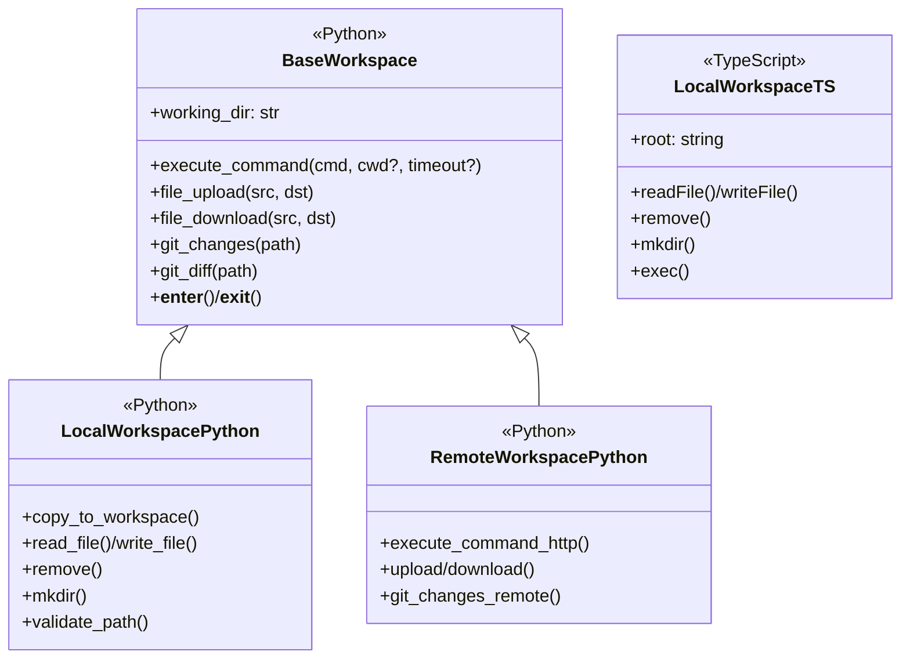
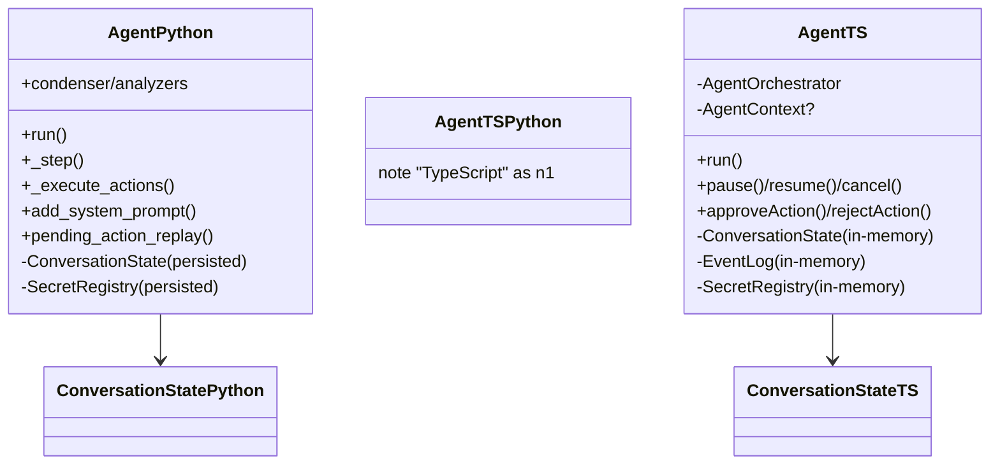
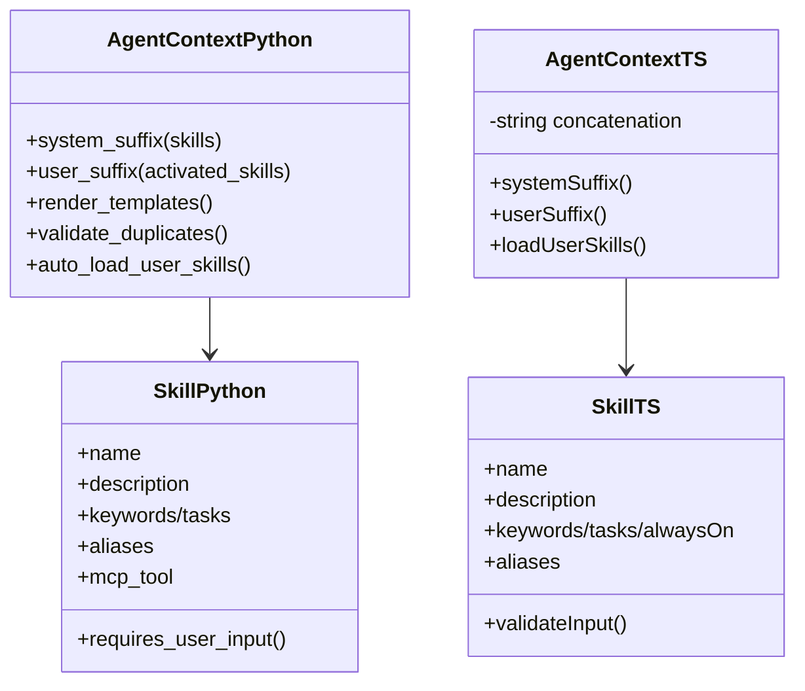
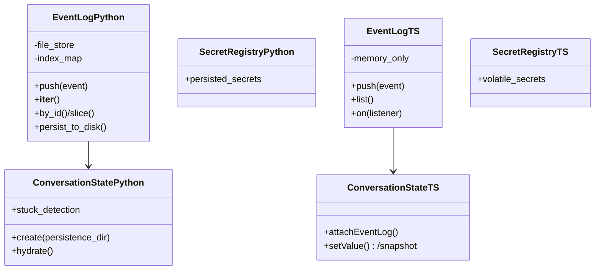

# Python ↔︎ TypeScript SDK parity guide

This document compares the Python `agent-sdk` (reference implementation) with the TypeScript `@openhands/agent-sdk-ts` (VS Code-focused SDK). It highlights where interfaces align, where behavior diverges, and what is missing for parity. Mermaid diagrams summarize key classes and relationships in each layer.

## Workspace layer

**Python shape**
- Factory `Workspace()` returns `LocalWorkspace` or `RemoteWorkspace` based on `host`/`api_key`, sharing `BaseWorkspace` with `working_dir`, context-manager support, and discriminated union typing.
- `LocalWorkspace` supports command execution with timeout/error metadata, git change/diff helpers, upload/download/copy operations, and strict path validation.
- `RemoteWorkspace` wraps HTTP endpoints for commands, file transfer, and git metadata, mirroring `CommandResult`/`FileOperationResult` schemas and queue-based locking.

**TypeScript shape**
- Only `LocalWorkspace` exists; it resolves workspace root, reads/writes/removes files, creates directories, and runs commands via VS Code APIs with minimal metadata.
- No shared base class or factory; no remote workspace or file transfer helpers.

**Gaps to close**
- Add workspace factory + base abstraction with `working_dir`, context manager/cleanup semantics, and discriminated typing for local vs remote.
- Port upload/download/copy helpers, git change/diff models, and richer `CommandResult` fields (timeout, stderr segmentation).
- Implement remote workspace with HTTP-backed command lifecycle and path validation parity.

**Source references**
- Python: openhands/sdk/workspace/base.py BaseWorkspace; openhands/sdk/workspace/local.py LocalWorkspace; openhands/sdk/workspace/remote/base.py RemoteWorkspace; openhands/sdk/workspace/remote/remote_workspace_mixin.py RemoteWorkspaceMixin.
- TypeScript: packages/agent-sdk-ts/src/workspace/LocalWorkspace.ts LocalWorkspace.

## Conversation layer

**Python shape**
- Factory `Conversation()` chooses `LocalConversation` vs `RemoteConversation` from workspace type, passing `persistence_dir`, `conversation_id`, callback stack, `max_iteration_per_run`, stuck detection toggle, visualizer implementation, and secrets.
- `LocalConversation` runs the `Agent` loop, persists events/state, supports resume-from-disk, and exposes context-manager cleanup.
- `RemoteConversation` prohibits persistence dir, relays messages over HTTP/WebSocket, mirrors confirmation/status callbacks, and replays history from the agent server.

**TypeScript shape**
- `Conversation()` selects `LocalConversation` (in-process) or `RemoteConversation` (WebSocket with HTTP history replay) from `serverUrl` presence.
- `LocalConversation` builds fresh `Agent`, `EventLog`, `ConversationState`, and `SecretRegistry`, emits `status/event/error/conversationStarted/terminal`, but has no persistence or cleanup hooks.
- `RemoteConversation` manages reconnect/replay and exposes settings mutation but only proxies chat/events (no remote workspace/file helpers).

**Gaps to close**
- Persistence-aware construction (resume from disk, persistence directory validation) and context-manager cleanup.
- Visualizer/stuck-detection hooks, richer callback chaining, and secret injection aligned with Python’s constructor signature.
- Remote workspace-aware commands, git/file helpers, and HTTP fallback parity (TS remote mode only streams chat/events).

**Source references**
- Python: openhands/sdk/conversation/conversation.py Conversation; openhands/sdk/conversation/base.py BaseConversation, ConversationStateProtocol; openhands/sdk/conversation/impl/local_conversation.py LocalConversation; openhands/sdk/conversation/impl/remote_conversation.py RemoteConversation; openhands/sdk/conversation/state.py ConversationState.
- TypeScript: packages/agent-sdk-ts/src/sdk/conversation/index.ts Conversation factory; packages/agent-sdk-ts/src/sdk/conversation/LocalConversation.ts LocalConversation; packages/agent-sdk-ts/src/sdk/conversation/RemoteConversation.ts RemoteConversation; packages/agent-sdk-ts/src/sdk/runtime/ConversationState.ts ConversationState.

## Agent lifecycle and orchestration

**Python shape**
- `Agent` extends `AgentBase`, injects system prompt with serialized tool schemas, enforces confirmation/security via analyzers, and supports condenser pipelines plus observability hooks.
- Drives `_step` loop with deduplication, condensed event windows, dual LLM APIs (responses vs completions), and pending-action replay with disk-backed `ConversationState`.
- Integrates with `SecretRegistry` persistence, stuck detection, and configurable confirmation policies.

**TypeScript shape**
- `Agent` wraps `AgentOrchestrator`, builds/attaches `EventLog`, `ConversationState`, `SecretRegistry`, optional tools/LLM client, and optional `AgentContext`.
- Methods: `run`, `pause/resume`, `cancel`, `approveAction/rejectAction`; enforces iteration cap, confirmation policy enum, and executes tool calls with basic error handling.
- No condenser, security analyzer, or persisted state replay; confirmation logic is minimal and local-only.

**Gaps to close**
- Add tool schema/security analyzer injection, condenser pipeline, and observability hooks around `runLoop`.
- Support persisted `ConversationState` restoration and pending-action replay.
- Implement responses-API parity and richer confirmation policies akin to Python analyzers.

**Source references**
- Python: openhands/sdk/agent/base.py AgentBase; openhands/sdk/agent/agent.py Agent; openhands/sdk/conversation/state.py ConversationState; openhands/sdk/conversation/conversation.py Conversation factory glue.
- TypeScript: packages/agent-sdk-ts/src/sdk/runtime/Agent.ts Agent; packages/agent-sdk-ts/src/sdk/runtime/AgentOrchestrator.ts AgentOrchestrator; packages/agent-sdk-ts/src/sdk/runtime/ConversationState.ts ConversationState; packages/agent-sdk-ts/src/sdk/runtime/SecretRegistry.ts SecretRegistry.

## AgentContext and skills

**Python AgentContext**
- Pydantic model with repo-skill templating (`system_message_suffix.j2`), triggered knowledge rendering, duplicate detection, auto-loading of user skills with warnings, and structured metadata.
- Produces both system and user suffixes with templated variables and activation tracking.

**TypeScript AgentContext**
- Lightweight class that concatenates always-on skills into Markdown and appends optional suffix; matches triggers via substring search and logs warnings for duplicates.
- Skill activation tracking is minimal and formatting is plain strings (no templating).

**Skill models**
- Python `Skill` uses Pydantic validation, keyword/task triggers, auto `/name` trigger for task skills, MCP tool metadata, input validation helpers (`requires_user_input`), and third-party aliasing.
- TypeScript `Skill` mirrors keyword/task/always-on triggers, aliasing, and missing-variable prompts but lacks MCP tool metadata, schema validation, and regex triggers.

**Gaps to close**
- Introduce template-driven rendering for system/user suffixes and richer trigger matching (regex, keyword weighting).
- Add MCP tool metadata, schema validation, and structured activation logs to TypeScript skills.

**Source references**
- Python: openhands/sdk/context/agent_context.py AgentContext; openhands/sdk/context/skills/skill.py Skill; openhands/sdk/context/skills/types.py SkillKnowledge, SkillResponse, SkillContentResponse.
- TypeScript: packages/agent-sdk-ts/src/sdk/context/agent-context.ts AgentContext; packages/agent-sdk-ts/src/sdk/context/skills/skill.ts Skill, SkillValidationError.

## Event logging, persistence, and events

**EventLog/persistence**
- Python `EventLog` is file-backed with deterministic filenames/indices, duplicate-ID detection, slicing/iteration helpers, and integration with `EventsListBase`, `persistence_const`, `serialization_diff`, and FIFO locks; `ConversationState.create` hydrates state (iteration counts, stuck detection) from disk, and `SecretRegistry` persists secrets.
- TypeScript `EventLog` is in-memory only; it normalizes IDs/timestamps, broadcasts listeners, and supports `push/list/on`. `ConversationState` is in-memory with optional `attachEventLog`; `SecretRegistry` is non-persisted.

**Gaps to close**
- Add file-backed storage with deterministic naming/indexing and duplicate protection; port persistence constants, diffing, and cross-process locks.
- Persist secrets and conversation state for resume/replay; expose hydration helpers mirroring Python’s `ConversationState.create`.

**Event interface coverage**
- Python events (Pydantic models) include: `SystemPromptEvent`, `ActionEvent`, `ObservationEvent`, `UserRejectObservation`, `MessageEvent`, `AgentErrorEvent`, `ConversationErrorEvent`, `TokenEvent`, `PauseEvent`, `Condensation`, `CondensationRequest`, `CondensationSummaryEvent`, `ConversationStateUpdateEvent` (all extend `Event`/`LLMConvertibleEvent` with `id`, `timestamp`, `source`, and type-specific fields like tool call IDs, reasoning, summaries).
- TypeScript events mirror most discriminated unions (`SystemPromptEvent`, `ActionEvent`, `ObservationEvent`, `UserRejectObservation`, `MessageEvent`, `AgentErrorEvent`, `ConversationErrorEvent`, `PauseEvent`, `Condensation`, `ConversationStateUpdateEvent`) but omit `TokenEvent` and condensation request/summary variants; metadata fields are narrower (e.g., no stuck-detection or condenser fields).

**Source references**
- Python: openhands/sdk/conversation/event_store.py EventLog; openhands/sdk/conversation/state.py ConversationState; openhands/sdk/conversation/persistence_const.py persistence constants; openhands/sdk/event/types.py event discriminators; openhands/sdk/event/conversation_state.py ConversationStateUpdateEvent; openhands/sdk/event/conversation_error.py ConversationErrorEvent; openhands/sdk/event/token.py TokenEvent; openhands/sdk/event/user_action.py ActionEvent/UserRejectObservation; openhands/sdk/event/condenser.py condensation events; openhands/sdk/event/base.py Event/LLMConvertibleEvent.
- TypeScript: packages/agent-sdk-ts/src/sdk/runtime/EventLog.ts EventLog; packages/agent-sdk-ts/src/sdk/runtime/ConversationState.ts ConversationState; packages/agent-sdk-ts/src/sdk/runtime/SecretRegistry.ts SecretRegistry; packages/agent-sdk-ts/src/sdk/types/index.ts SystemPromptEvent, MessageEvent, ActionEvent, ObservationEvent, ConversationStateUpdateEvent, ConversationErrorEvent, PauseEvent, Condensation, is* guards.

## Quick checklist for parity work
- Implement workspace factory/base with remote support, path validation, git helpers, and richer command metadata.
- Extend conversations with persistence, visualizer/stuck-detection hooks, callback stacks, and remote workspace helpers.
- Augment agent with condenser/security analyzers, persisted state replay, and expanded confirmation policies.
- Add template-aware `AgentContext`, MCP-aware `Skill` metadata/validation, and richer trigger matching.
- Provide file-backed `EventLog`, state/secret persistence helpers, and the missing event variants (`TokenEvent`, condensation request/summary).
