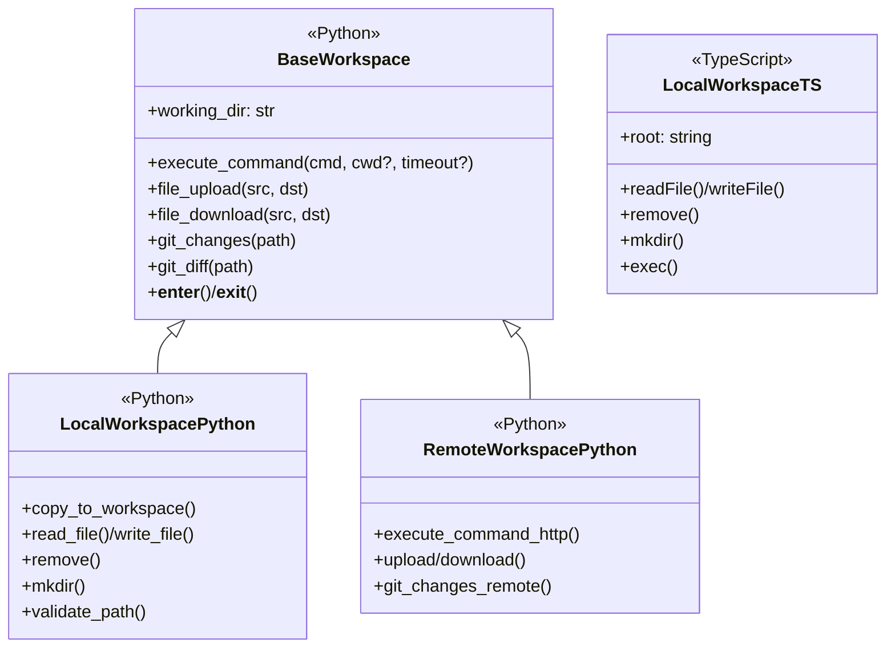
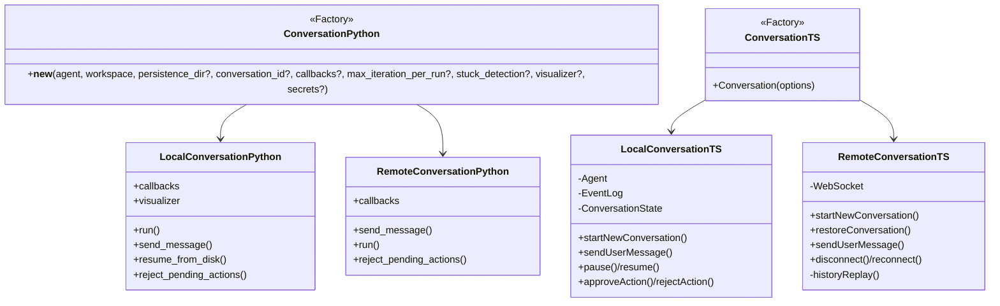
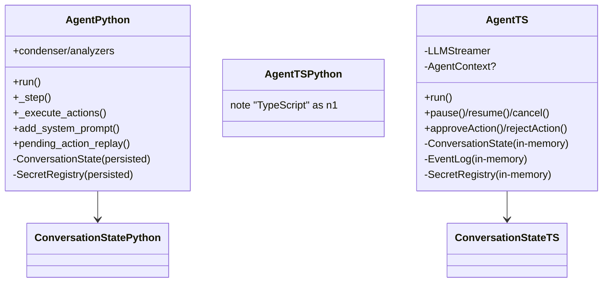
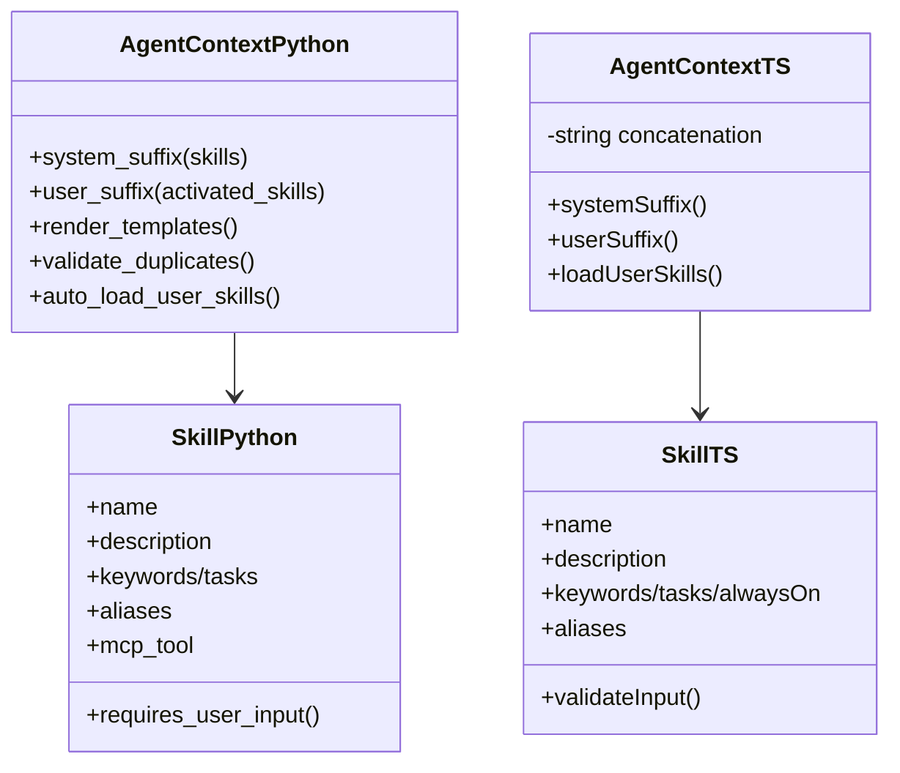
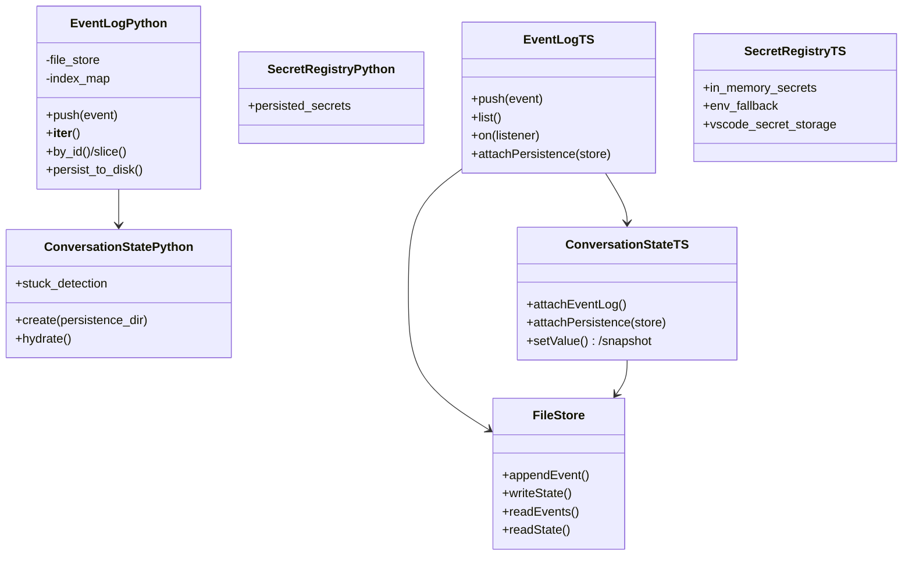

# Python ↔︎ TypeScript SDK parity guide

This document compares the Python `agent-sdk` (reference implementation) with the TypeScript `@openhands/agent-sdk-ts` (VS Code-focused SDK). It highlights where interfaces align, where behavior diverges, and what is missing for parity. Mermaid diagrams summarize key classes and relationships in each layer.

## Audit scope (oh-tab-0rq)

This document is the living output for Beads issue `oh-tab-0rq`.

- TypeScript SDK: `packages/agent-sdk-ts` (this repo).
- Python reference SDK: `~/repos/agent-sdk` ([OpenHands/software-agent-sdk](https://github.com/OpenHands/software-agent-sdk)).
- Focus: VS Code local-mode parity and remote conversation working correctly (no agent-server implementation in TS).

## Module structure overview

Quick reference for module-level parity between Python and TypeScript SDKs.

| Module | Python | TypeScript | Notes |
|--------|--------|-----------|-------|
| agent/ | ✓ `Agent`, `AgentBase` | ✓ `Agent` in runtime/ | TS has separate `LLMStreamer` |
| context/ | ✓ | ✓ | Similar skill/context handling |
| conversation/ | ✓ | ✓ | Both have Local/Remote variants |
| critic/ | ✓ | ✗ | Evaluation framework, Python only (not planned) |
| event/ | ✓ | ✓ types/ | Different patterns (class vs interface) |
| git/ | ✓ | ✗ | Full git utilities, Python only (not planned) |
| hooks/ | ✓ | ✗ | Hook execution pipeline (pre/post tool use, stop hook) |
| io/ | ✓ `FileStore` | ✗ | Abstracted file storage, Python only (not planned) |
| llm/ | ✓ | ✓ | Different approaches (LiteLLM vs native) |
| logger/ | ✓ Rich/JSON | ✗ | Comprehensive logging, Python only (not planned) |
| mcp/ | ✓ | ✗ | Model Context Protocol, Python only (not planned) |
| observability/ | ✓ Laminar/OTEL | ✗ | Telemetry, Python only (not planned) |
| secret/ | ✓ | ✓ runtime/ | TS has `SecretRegistry` in runtime |
| security/ | ✓ module | ✓ inline in Agent | Python has separate module; TS has inline handling |
| tool/ | ✓ | ✓ tools/ | Different validation approaches (Pydantic vs Zod) |
| workspace/ | ✓ | ✓ | Python has more complete remote support |

### Features in Python but NOT in TypeScript

1. **Security Module** (separate module vs inline)
   - Python has dedicated `security/` module with `SecurityAnalyzer`, `LLMSecurityAnalyzer`
   - TypeScript has inline security risk handling in `Agent.ts`:
     - `SecurityRisk` type: `'UNKNOWN' | 'LOW' | 'MEDIUM' | 'HIGH'`
     - `security_risk` field on `ActionEvent`
     - `parseSecurityRisk()` and `requiresConfirmation()` methods
     - Confirmation settings with `policy`, `riskyThreshold`, `confirmUnknown`
   - Both use LLM to assess risk per tool call (TS via system prompt instructions, Python via analyzer)
   - **Gap**: Python has separate analyzer classes for modularity; TS has inline implementation

2. **Critic Module** - `CriticBase`, `AgentFinishedCritic`, `EmptyPatchCritic`, `PassCritic` (not planned)

3. **Git Module** - `GitDiff`, `GitChanges`, `GitManager` (not planned)

4. **IO/FileStore Module** - `FileStore` abstract base, `LocalFileStore`, `InMemoryFileStore` (not planned)

5. **Observability Module** - Laminar integration, OpenTelemetry, `@observe` decorator (not planned)

6. **Logger Module** - Rich console logging, JSON logging, rotating file handlers (not planned)

7. **MCP** - `MCPClient` for external tool integration (not planned)

8. **LLM routing + provider error normalization**
   - Python: LiteLLM-based routing strategies and provider exception mapping into typed SDK exceptions.
   - TypeScript: native provider clients + LLM Profiles + an `LLMRegistry` + `Metrics` exist, but there is no router/fallback layer and provider-specific exception normalization is tracked as parity work (GH #661).

9. **Hooks System** - `HookManager`, `HookExecutor`, event interception (pre/post tool use, post event, stop hook)

10. **Public skills repo loading** (`load_public_skills`)
    - TypeScript: not implemented.
    - Note (2026-01-12): TypeScript now supports AgentSkills (SKILL.md directories) with strict naming, `<available_skills>` progressive disclosure, resource discovery, `.mcp.json` loading with variable expansion, and third-party repo skill files (`.cursorrules`, `AGENTS.md`, `CLAUDE.md`, `GEMINI.md`) with truncation + vendor-family gating.

11. **Plugins + custom tool loading** - plugin data model, directory loading, and remote custom tools support

12. **Tools** - `TomConsultTool`, extended `BrowserUseTool` with Windows impl

13. **Conversation Features** - `ConversationVisualizer`, `ConversationStats`, `StuckDetector`, `TitleUtils`

### Features in TypeScript but NOT in Python

1. **LLMStreamer** - Separate orchestration layer (Python has this in Agent class)

2. **LLM Profiles System** - Profile-based provider management, native clients (Anthropic, OpenAI-compatible, Gemini)

3. **Summarization Utilities** - `fileDiffSummarizer`, `gitChangeSummarizer`, `terminalObservationSummarizer`

4. **Error Handling** - `errorPolicy.ts`, `toolCallErrorEvents.ts`

5. **Tool Validation** - `ZodTool` wrapper for zod schema-based validation

6. **IntegratedTerminalRunner** - Direct VS Code terminal integration

7. **ApplyPatchTool** - TypeScript-only builtin tool (not present in the Python fork at `~/repos/agent-sdk`)

### Cross-cutting differences

| Aspect | Python | TypeScript |
|--------|--------|-----------|
| Event pattern | Class inheritance | Discriminated union interfaces |
| Event discriminator | Class name / `isinstance()` | `kind` field string |
| Validation | Pydantic models | Zod schemas |
| LLM abstraction | LiteLLM (provider agnostic) | Native provider clients |
| Async handling | Sync-first with optional async | Async-first (Promise-based) |
| Execution status | `ConversationExecutionStatus` enum | String literals |

## Current parity snapshot (2026-01-10)

This section summarizes concrete behavior alignment between Python agent-sdk and TypeScript @openhands/agent-sdk-ts observed today, with pointers to code/tests and gaps to close.

- Tool error messages (MessageEvent with role="tool")
  - Python: events_to_messages converts AgentErrorEvent to a tool Message with plain text error content. No JSON encoding. See tests/sdk/event/test_events_to_messages.py::test_agent_error_event.
  - TypeScript: createToolCallErrorEvents emits a tool MessageEvent with plain text error content (not JSON). See src/sdk/runtime/toolCallErrorEvents.ts.
  - Truncation: TS caps error text at 4096 chars and appends " (truncated)"; Python does not enforce a 4096 cap in conversion (viewer utilities may truncate for display). Status: content format aligned (plain text); truncation policy diverges.

- Tool-call argument redaction (llm_tool_call_raw and logs)
  - Python: Secrets masking is applied to tool observations (e.g., Terminal) via SecretRegistry.mask_secrets_in_output; broader recursive argument redaction is not centrally enforced for tool-call argument logging.
  - TypeScript: Agent redacts recursively with heuristics, masking known keys (apiKey, token, password, client_secret, etc.) to "***" and masking Authorization: Bearer tokens in strings. See src/sdk/runtime/Agent.ts redactObject/redactStringHeuristics and tests: `Agent.redaction.test.ts` and `Agent.tool-call-redaction.test.ts`.
  - Status: TS adds stronger argument redaction for logs; Python focuses on observation output masking. Parity gap: but we are fine with it as long as the TS version doesn't display keys to the user or save them in logs.

- security_risk on ActionEvent
  - Python: ActionEvent always has security_risk (defaults to UNKNOWN if omitted). See tests/cross/test_remote_conversation_live_server.py and tests/sdk/agent/test_extract_security_risk.py.
  - TypeScript: security_risk is optional; parseToolArgs pops security_risk from arguments and returns undefined when missing/invalid. See src/sdk/runtime/Agent.ts parseToolArgs/parseSecurityRisk and tests: `Agent.security-risk.test.ts`.
  - Status: Divergence. Consider adding defaulting to UNKNOWN in TS when integrating with agent-server.

- ActionEvent summary + reasoning metadata
  - Python: ActionEvent includes `summary`, `thinking_blocks`, and `responses_reasoning_item` (for Responses API), and uses these in UI/visualization. See openhands/sdk/event/llm_convertible/action.py.
  - TypeScript: ActionEvent includes `thought`, `reasoning_content`, `thinking_blocks`, and `responses_reasoning_item`; `summary` is not represented in the TypeScript ActionEvent model. See packages/agent-sdk-ts/src/sdk/types/index.ts ActionEvent.
  - Status:
    - `summary`: not a TS parity gap for OpenHands-Tab, because we don’t rely on server-provided action summaries (Gemini Flash generates summaries on the fly).
    - `thinking_blocks` and `responses_reasoning_item`: aligned for parity/debuggability.

- ConversationErrorEvent visualization
  - Python: ConversationErrorEvent now defines `visualize()` for UI output. See openhands/sdk/event/conversation_error.py.
  - TypeScript: no visualization helpers for ConversationErrorEvent (type only).
  - Status: Divergence in UI/event rendering.

- Default LLM timeout
  - Python: LLM default timeout raised to 300s (`timeout` default in LLM config). See openhands/sdk/llm config defaults.
  - TypeScript: DEFAULT_TIMEOUT_MS is 300s (300_000ms) unless overridden. See packages/agent-sdk-ts/src/sdk/llm/types.ts.
  - Status: Aligned.

- include_default_tools option
  - Python: Agent supports `include_default_tools` to selectively include built-in tools or disable all defaults. See openhands/sdk/agent/base.py and tests/sdk/agent/test_agent_tool_init.py.
  - TypeScript: supports `includeDefaultTools?: boolean | string[]` to disable defaults or select a subset when tools are omitted. See packages/agent-sdk-ts/src/sdk/conversation/index.ts and tests: packages/agent-sdk-ts/src/sdk/conversation/LocalConversation.test.ts.
  - Status: Aligned (API naming differs).

- AgentSkills (SKILL.md) + repo skill files
  - Python: SKILL.md directories with strict naming, progressive disclosure (`to_prompt()` XML), resources, `.mcp.json` support, and optional public skills loading. See openhands/sdk/context/skills/*.py and openhands/sdk/context/agent_context.py.
  - TypeScript: supports SKILL.md directories with strict naming, `<available_skills>` progressive disclosure, resource discovery, `.mcp.json` parsing/validation with variable expansion, and third-party repo skill files (`.cursorrules`, `AGENTS.md`, `CLAUDE.md`, `GEMINI.md`) with truncation + vendor-family gating.
  - Status: Parity largely aligned; remaining gap is public skills repo loading.

- tool_call_id propagation
  - Python: tool_call_id is preserved across ActionEvent, ObservationEvent, AgentErrorEvent, and tool MessageEvent. See tests/sdk/event/test_events_to_messages.py and cross tests.
  - TypeScript: tool_call_id is populated consistently in ActionEvent/ObservationEvent and in error/tool messages. See src/sdk/runtime/Agent.ts and toolCallErrorEvents.ts and tests: `Agent.tool-errors.test.ts`.
  - Status: Aligned.

- AgentErrorEvent shape
  - Python: includes error (text), tool_name, tool_call_id. See tests/sdk/event/test_event_serialization.py and test_events_to_messages.py.
  - TypeScript: same fields present. See src/sdk/types/index.ts and toolCallErrorEvents.ts. Status: Aligned.

- Message roles and conversion
  - Python: LLMConvertibleEvent.events_to_messages builds system/user/assistant/tool messages; tool responses set role="tool" and include tool_call_id/name; agent errors become role="tool" messages with the error text. See tests/sdk/event/test_events_to_messages.py.
  - TypeScript: Agent pushes MessageEvents with role="tool" for observations and errors; assistant messages carry tool_calls; schemas mirror Python. See src/sdk/runtime/Agent.ts and tests.
  - Status: Aligned for core paths used by VS Code extension.

- Persistence and EventLog
  - Python: File-backed EventLog, deterministic IDs, resume-from-disk via ConversationState.create, FIFO locks, etc.
  - TypeScript: FileStore-backed persistence exists (events + state) and LocalConversation supports restore. See `packages/agent-sdk-ts/src/sdk/runtime/persistence.ts` and tests: `packages/agent-sdk-ts/src/sdk/__tests__/persistence.test.ts`.

- Tool observation content (role="tool" messages)
  - Python: tool observations are LLM-facing plain text via Observation helpers (e.g., TerminalObservation appends metadata and uses `<response clipped>` truncation). See `tests/tools/terminal/test_observation_truncation.py`.
  - TypeScript: Agent formats tool MessageEvent content as plain text for core tools (terminal, file_editor), applies secret masking, and clips oversized outputs with `<response clipped>`. See `packages/agent-sdk-ts/src/sdk/runtime/Agent.ts` and tests: `packages/agent-sdk-ts/src/sdk/runtime/__tests__/Agent.tool-messages.test.ts` (PR #250 / `oh-tab-bcu`).
  - Status: Aligned for VS Code local-mode usage (minor policy differences remain, e.g., default clip length).

- Terminal session semantics
  - Python: persistent shell session; supports `is_input` (stdin/log polling) and `reset`. See `tests/tools/terminal/test_terminal_session.py`.
  - TypeScript: supports persistent session semantics (cwd/env persistence), rejects concurrent non-empty commands, and supports `is_input`/`reset`. See `packages/agent-sdk-ts/src/tools/TerminalTool.ts` and `packages/agent-sdk-ts/src/tools/TerminalSession.ts` (PR #251 / `oh-tab-wmn`).
  - Status: Aligned for VS Code local-mode usage.

Other gaps to consider
- security_risk defaulting: consider default UNKNOWN in TS when interoperating with an agent-server (remote conversation) to match Python expectations.
- Remote workspace behaviors: not planned in TS today (remote mode is handled via agent-server + RemoteConversation).

## Candidate test cases to mirror (from `~/repos/agent-sdk`)

These Python tests are the most directly relevant “spec” for VS Code local-mode parity work. Use them to drive new Vitest coverage in `packages/agent-sdk-ts` (tests first, then implementation).

### Terminal tool

- Python: `tests/tools/terminal/test_terminal_tool.py` (basic execution, schema) → TypeScript: `packages/agent-sdk-ts/src/tools/__tests__/tools.test.ts` (expand coverage).
- Python: `tests/tools/terminal/test_observation_truncation.py` (LLM-facing output formatting + `<response clipped>`) → TypeScript: `packages/agent-sdk-ts/src/sdk/runtime/__tests__/Agent.tool-messages.test.ts` (PR #250 / `oh-tab-bcu`).
- Python: `tests/tools/terminal/test_terminal_session.py`, `tests/tools/terminal/test_shutdown_handling.py`, `tests/tools/terminal/test_shell_path_configuration.py` → TypeScript: `packages/agent-sdk-ts/src/tools/__tests__/tools.test.ts` (PR #251 / `oh-tab-wmn`).
- Python: `tests/tools/terminal/test_secrets_masking.py` → TypeScript: `packages/agent-sdk-ts/src/sdk/runtime/__tests__/Agent.tool-messages.test.ts` (PR #250 / `oh-tab-bcu`).

### File editor tool

- Python: `tests/tools/file_editor/test_basic_operations.py` (create/view/str_replace/insert/undo_edit) → TypeScript: covered by `packages/agent-sdk-ts/src/tools/__tests__/tools.test.ts` + FileEditorTool tests (PR #245 / `oh-tab-nbc`).
- Python: `tests/tools/file_editor/test_schema.py` (command enum includes undo_edit) → TypeScript: schema/docs updates in PR #252 / `oh-tab-8zn`.
- Python: `tests/tools/file_editor/test_workspace_root.py`, `tests/tools/file_editor/test_file_validation.py`, `tests/tools/file_editor/test_view_supported_binary_files.py` → TypeScript: implemented in PR #253 / `oh-tab-7d4`.

### Glob/Grep tools

- Python: `tests/tools/glob/test_glob_tool.py`, `tests/tools/glob/test_consistency.py` → TypeScript: implemented in PR #248 / `oh-tab-2wx` (fixtures, ignore, truncation).
- Python: `tests/tools/grep/test_grep_tool.py`, `tests/tools/grep/test_consistency.py` → TypeScript: implemented in PR #248 / `oh-tab-2wx` (fixtures, ignore, truncation).

### Runtime/events/workspace

- Python: `tests/sdk/event/test_events_to_messages.py`, `tests/sdk/event/test_event_serialization.py` → TypeScript: `packages/agent-sdk-ts/src/sdk/__tests__/agent-sdk.guards.test.ts` + runtime tests (expand into message conversion parity).
- Python: `tests/sdk/security/test_confirmation_policy.py` → TypeScript: `packages/agent-sdk-ts/src/sdk/__tests__/agent.loop.test.ts` and `packages/agent-sdk-ts/src/sdk/runtime/__tests__/Agent.security-risk.test.ts`.
- Python: `tests/sdk/io/test_local_filestore_security.py` → TypeScript: `packages/agent-sdk-ts/src/workspace/__tests__/local.workspace.test.ts` (PR #244 / `oh-tab-pla`).

## Beads follow-ups (created from this audit)

- `oh-tab-wmn` — agent-sdk-ts: TerminalTool persistent session + is_input/reset parity
- `oh-tab-bcu` — agent-sdk-ts: Tool MessageEvent content parity (avoid JSON-only tool outputs)
- `oh-tab-nbc` — agent-sdk-ts: FileEditorTool undo_edit parity
- `oh-tab-7d4` — agent-sdk-ts: FileEditorTool directory view + binary handling parity
- `oh-tab-pla` — agent-sdk-ts: LocalWorkspace symlink/path security parity
- `oh-tab-2wx` — agent-sdk-ts: GlobTool/GrepTool parity (fixtures, ignore, truncation)

## Workspace layer

### Python shape

- Factory `Workspace()`
  - Returns `LocalWorkspace` or `RemoteWorkspace` based on `host`/`api_key`
  - Shares `BaseWorkspace` with `working_dir`, context-manager support, and discriminated union typing
- `LocalWorkspace`
  - Command execution with timeout/error metadata
  - Git change/diff helpers
  - Upload/download/copy operations
  - Strict path validation
  - `pause()`/`resume()` hooks (no-ops locally, implemented for remote)
- `RemoteWorkspace`
  - Wraps HTTP endpoints for commands, file transfer, and git metadata
  - Mirrors `CommandResult`/`FileOperationResult` schemas
  - Queue-based locking
  - `alive` property for readiness checks

### TypeScript shape

- Only `LocalWorkspace` exists (no `RemoteWorkspace` today).
  - Resolves workspace root
  - Reads/writes/removes files
  - Creates directories
  - Runs commands via VS Code APIs with minimal metadata
- No shared base class or factory.
- No remote workspace or file transfer helpers.

### Gaps to close

- Add workspace factory + base abstraction with `working_dir`, context manager/cleanup semantics, and discriminated typing for local vs remote
- Port upload/download/copy helpers, git change/diff models, and richer `CommandResult` fields (timeout, stderr segmentation)
- Implement remote workspace with HTTP-backed command lifecycle and path validation parity
- Add `pause()`/`resume()` plumbing and `alive` readiness surface for remote workspaces



### Source references
- Python: openhands/sdk/workspace/base.py BaseWorkspace; openhands/sdk/workspace/local.py LocalWorkspace; openhands/sdk/workspace/remote/base.py RemoteWorkspace; openhands/sdk/workspace/remote/remote_workspace_mixin.py RemoteWorkspaceMixin.
- TypeScript: packages/agent-sdk-ts/src/workspace/LocalWorkspace.ts LocalWorkspace.

## Conversation layer

### Python shape

- Factory `Conversation()`
  - Chooses `LocalConversation` vs `RemoteConversation` based on workspace type
  - Passes `persistence_dir`, `conversation_id`, callback stack, `max_iteration_per_run`, stuck detection toggle, visualizer implementation, and secrets
- `LocalConversation`
  - Runs the `Agent` loop
  - Persists events/state
  - Supports resume-from-disk
  - Exposes context-manager cleanup
- `RemoteConversation`
  - Prohibits persistence dir
  - Relays messages over HTTP/WebSocket
  - Mirrors confirmation/status callbacks
  - Replays history from the agent server

### TypeScript shape

- `Conversation()`
  - Selects `LocalConversation` (in-process) or `RemoteConversation` (WebSocket with HTTP history replay) based on `serverUrl` presence
- `LocalConversation`
  - Builds fresh `Agent`, `EventLog`, `ConversationState`, and `SecretRegistry`
  - Emits `status/event/error/conversationStarted/terminal`
  - Has no persistence or cleanup hooks
- `RemoteConversation`
  - Manages reconnect/replay and exposes settings mutation
  - Only proxies chat/events (no remote workspace/file helpers)

### Gaps to close

- Persistence-aware construction (resume from disk, persistence directory validation) and context-manager cleanup
- Visualizer/stuck-detection hooks, richer callback chaining, and secret injection aligned with Python's constructor signature
- Remote workspace-aware commands, git/file helpers, and HTTP fallback parity (TS remote mode only streams chat/events)



### Source references
- Python: openhands/sdk/conversation/conversation.py Conversation; openhands/sdk/conversation/base.py BaseConversation, ConversationStateProtocol; openhands/sdk/conversation/impl/local_conversation.py LocalConversation; openhands/sdk/conversation/impl/remote_conversation.py RemoteConversation; openhands/sdk/conversation/state.py ConversationState.
- TypeScript: packages/agent-sdk-ts/src/sdk/conversation/index.ts Conversation factory; packages/agent-sdk-ts/src/sdk/conversation/LocalConversation.ts LocalConversation; packages/agent-sdk-ts/src/sdk/conversation/RemoteConversation.ts RemoteConversation; packages/agent-sdk-ts/src/sdk/runtime/ConversationState.ts ConversationState.

### RemoteConversation detailed comparison (2025-12-25)

Python's RemoteConversation has significantly more features than TypeScript's implementation.

#### Helper classes

| Class | Python | TypeScript | Notes |
|-------|--------|-----------|-------|
| `WebSocketCallbackClient` | ✓ separate class with thread, retry | ✓ inline in RemoteConversation | Similar reconnect logic |
| `RemoteEventsList` | ✓ list-like with caching, indexing, `__getitem__` | ✗ only `seenEventIds` Set | Python caches events with full list interface |
| `RemoteState` | ✓ full state interface | ✗ no remote state abstraction | Python exposes execution_status, confirmation_policy, security_analyzer, stats, agent, workspace, persistence_dir |

#### API methods

| Method | Python | TypeScript | Notes |
|--------|--------|-----------|-------|
| `send_message()` | ✓ | ✓ `sendUserMessage()` | Aligned |
| `run()` | ✓ | ✓ `resume()` | Aligned (different name) |
| `pause()` | ✓ | ✓ | Aligned |
| `approveAction()`/`rejectAction()` | ✓ `run()` (approve/continue), `reject_pending_actions()` (reject) | ✓ | Aligned (Python approve is implicit via `run()`) |
| `set_confirmation_policy()` | ✓ | ✗ | Python only |
| `set_security_analyzer()` | ✓ | ✗ | Python only |
| `update_secrets()` | ✓ | ✗ | Python only |
| `ask_agent()` | ✓ stateless question endpoint | ✗ | Python only |
| `generate_title()` | ✓ | ✗ | Python only |
| `condense()` | ✓ force condensation | ✗ | Python only |
| `close()` | ✓ | ✓ `disconnect()` | Aligned |
| `setServerUrl()` | ✗ | ✓ | TypeScript only - dynamic URL change |
| `setSettings()` | ✗ | ✓ | TypeScript only - dynamic settings change |
| `reconnect()` | ✗ | ✓ | TypeScript only - manual reconnect trigger |

#### Callback system

| Feature | Python | TypeScript |
|---------|--------|-----------|
| Event callbacks | ✓ composable callback stack | ✓ EventEmitter pattern |
| Visualizer callbacks | ✓ | ✗ |
| State update callbacks | ✓ `create_state_update_callback()` | ✗ |
| LLM completion log callbacks | ✓ | ✗ |

#### Gaps to close for RemoteConversation

- Add `RemoteState` class or equivalent state abstraction for accessing remote execution_status, confirmation_policy, stats
- Implement `ask_agent()` for stateless questions
- Implement `generate_title()` for conversation titling
- Implement `condense()` for forcing condensation
- Implement `set_confirmation_policy()` and `set_security_analyzer()` for runtime policy changes
- Implement `update_secrets()` for runtime secret injection
- Add callback composition pattern matching Python's `compose_callbacks()`

## Agent lifecycle and orchestration

### Python shape

- `Agent` extends `AgentBase`
  - Injects system prompt with serialized tool schemas
  - Enforces confirmation/security via analyzers
  - Supports condenser pipelines plus observability hooks
- Drives `_step` loop
  - Deduplication
  - Condensed event windows
  - Dual LLM APIs (responses vs completions)
  - Pending-action replay with disk-backed `ConversationState`
- Integrates with `SecretRegistry` persistence, stuck detection, and configurable confirmation policies
- Confirmation: approval is implicit (call `run()` again); rejection uses `reject_pending_actions(reason)`

### TypeScript shape

- `Agent` wraps `LLMStreamer`
  - Builds/attaches `EventLog`, `ConversationState`, `SecretRegistry`
  - Optional tools/LLM client and optional `AgentContext`
- Methods: `run`, `pause/resume`, `cancel`, `approveAction/rejectAction`
  - Enforces iteration cap
  - Confirmation policy enum
  - Executes tool calls with basic error handling
- No condenser, security analyzer, or persisted state replay
- Confirmation logic is minimal and local-only

### Gaps to close

- Add tool schema/security analyzer injection, condenser pipeline
- Note: we do not want observability in TS.
- Support persisted `ConversationState` restoration and pending-action replay (implemented in PR #246 / `oh-tab-wc7`).
- Implement responses-API parity and richer confirmation policies akin to Python analyzers
- Add hook execution pipeline (pre/post tool use, post event, stop hook)



### Source references
- Python: openhands/sdk/agent/base.py AgentBase; openhands/sdk/agent/agent.py Agent; openhands/sdk/conversation/state.py ConversationState; openhands/sdk/conversation/conversation.py Conversation factory glue.
- TypeScript: packages/agent-sdk-ts/src/sdk/runtime/Agent.ts Agent; packages/agent-sdk-ts/src/sdk/runtime/LLMStreamer.ts LLMStreamer; packages/agent-sdk-ts/src/sdk/runtime/ConversationState.ts ConversationState; packages/agent-sdk-ts/src/sdk/runtime/SecretRegistry.ts SecretRegistry.

## AgentContext and skills

### Python AgentContext

- Pydantic model with repo-skill templating
  - Uses `system_message_suffix.j2` templates
  - Triggered knowledge rendering
  - Duplicate detection
  - Auto-loading of user skills with warnings (skills). Note: Python also supports legacy “microagents”; TypeScript does not load legacy microagents today.
  - Optional public skills loading from OpenHands/skills
  - Structured metadata
- Produces both system and user suffixes
  - Templated variables
  - Activation tracking
  - `<available_skills>` XML via `to_prompt()` for progressive disclosure
  - Model-family gating for vendor-specific repo skills (CLAUDE.md/GEMINI.md)

### TypeScript AgentContext

- Lightweight class that concatenates repo skills into a system suffix and triggered skills into a user suffix
  - Matches triggers (keyword/task) and logs warnings for duplicates
- Supports AgentSkills progressive disclosure via `<available_skills>` (lists available skills by name/description/location; full content is injected only when triggered)
- Supports model-family gating for vendor-specific repo instructions (`CLAUDE.md`/`GEMINI.md`) and handles profiles-first settings (when `llm.profileId` is selected)
- No public skills repo loading

### Skill models

- **Python `Skill`**
  - Pydantic validation
  - Keyword/task triggers
  - Auto `/name` trigger for task skills
  - Input validation helpers (`requires_user_input`)
  - Third-party aliasing
  - AgentSkills standard fields (name/description/metadata)
  - SKILL.md directory convention with strict name validation
  - Progressive disclosure metadata + `<available_skills>` prompt format
  - Resource discovery (`scripts/`, `references/`, `assets/`)
  - MCP tool metadata + `.mcp.json` loading with variable expansion
  - Third-party files: `.cursorrules`, `AGENTS.md`, `CLAUDE.md`, `GEMINI.md` (truncates oversized files)

- **TypeScript `Skill`**
  - Mirrors keyword/task/always-on triggers
  - Aliasing and missing-variable prompts
  - AgentSkills (SKILL.md directories) with strict naming validation
  - Resource discovery (`scripts/`, `references/`, `assets/`) and optional `.mcp.json` parsing/validation with variable expansion
  - Third-party files: `.cursorrules`, `AGENTS.md`, `CLAUDE.md`, `GEMINI.md` (truncates oversized files; vendor-gated where applicable)
  - Trigger matching is substring-based (same as Python); template-driven prompt rendering and richer trigger semantics are optional enhancements (not parity)

### Gaps to close
- Add public skills repo loading (`load_public_skills`)
- Optional enhancements (not python parity): template-driven prompt rendering and richer trigger semantics (regex/weights, scoring)



### Source references
- Python: openhands/sdk/context/agent_context.py AgentContext; openhands/sdk/context/skills/skill.py Skill; openhands/sdk/context/skills/types.py SkillKnowledge, SkillResponse, SkillContentResponse.
- TypeScript: packages/agent-sdk-ts/src/sdk/context/agent-context.ts AgentContext; packages/agent-sdk-ts/src/sdk/context/skills/skill.ts Skill, SkillValidationError.

## Tool and event parity

### Python tool architecture

In Python, tools are modeled as `ToolDefinition[ActionT, ObservationT]` with a few key components:

- `Action` and `Observation` are Pydantic models (see `openhands.sdk.tool.schema`) that define the structured input/output for a tool.
- A `ToolDefinition` instance carries:
  - `name`, `description`, `annotations`, `meta`
  - `action_type` and `observation_type` (the concrete `Action`/`Observation` subclasses)
  - a runtime-only `executor: ToolExecutor[ActionT, ObservationT] | None` which performs the side effects
- `ToolExecutor.__call__(self, action: ActionT, conversation: LocalConversation | None) -> ObservationT` is responsible for executing the tool logic. For example, the Terminal tool uses an executor that runs shell commands in the workspace and returns an `ExecuteBashObservation`.
- The `Agent` never calls tools directly with raw args. Instead, the flow is:
  1. LLM produces a tool call (function name + JSON arguments).
  2. `_get_action_event` parses/validates arguments into an `Action` instance (e.g., `ExecuteBashAction`) and emits an `ActionEvent`.
  3. `_execute_action_event` looks up the corresponding `ToolDefinition`, invokes its `executor(action, conversation)`, and receives an `Observation`.
  4. The `Observation` is wrapped in an `ObservationEvent` and appended to the conversation.
- The `ConversationState` ties everything together by tracking events (including `ActionEvent`/`ObservationEvent`) and execution status.

### TypeScript tool architecture today

In TypeScript, the core tool abstraction is `ToolDefinition<TArgs, TResult>` (see `src/sdk/types/tools.ts`):

- `ToolDefinition` defines:
  - `name`, optional `description` and `parameters` (for schema)
  - `validate(input: unknown): TArgs` to coerce LLM arguments into a concrete args object
  - `execute(args: TArgs, context: ToolContext): Promise<TResult>` which performs the side effects and returns a result
  - an optional `getToolDefinition()` to expose an LLM-facing tool schema (`LLMToolDefinition`).
- Tools like `TerminalTool`, `FileEditorTool`, etc. currently implement `execute()` directly and return a simple result object (`TerminalResult`, `FileEditorResult`, ...). There are no explicit `Action`/`Observation` classes.
- The `Agent` loop (`src/sdk/runtime/Agent.ts`) handles tool calls by:
  1. Parsing `tool_call.arguments` as JSON.
  2. Validating arguments via `tool.validate()`.
  3. Emitting an `ActionEvent` (using the validated args as a plain record, not a typed `Action` subclass).
  4. Executing `tool.execute(args, context)` once confirmation policy allows.
  5. Wrapping the returned result in an `ObservationEvent` where `observation` is a plain JSON object.
- Event interfaces in `src/sdk/types/index.ts` mirror the Python wire format: `ActionEvent` and `ObservationEvent` are present, but they carry raw records (`Record<string, unknown>`) instead of strongly-typed `Action`/`Observation` models.

### Gaps and intended direction

- The TS runtime currently has **ActionEvent/ObservationEvent types but no first-class Action/Observation classes**. The Python stack uses Pydantic models for validation, kind resolution, and serialization; TS simply forwards validated args/results as plain JSON.
- There is no `ToolDefinition`/`ToolExecutor` split in TS. `ToolDefinition.execute` is both the definition and executor. This is enough for VS Code usage but diverges from Python, where the executor can be swapped or wrapped (e.g., for remote execution, observability, or sandboxing).
- The Python Agent works in terms of `ActionEvent`→`ToolExecutor`→`ObservationEvent`. TS mirrors the **event shapes** but shortcuts the intermediate typed models.
- This is fine.

**Practical parity goal for now:**

Rather than fully re-implementing Pydantic-style action/observation classes in TS, the near-term goal is:

- Keep the event wire format aligned (ActionEvent/ObservationEvent shapes stay compatible with Python).
- Ensure each tool has a well-defined input/result schema and that the Agent loop always:
  - emits an `ActionEvent` when the LLM calls a tool;
  - executes the corresponding tool;
  - emits an `ObservationEvent` with the structured result.

`TerminalTool` is the first place where we validate this end-to-end behavior for a “real” environment-interacting tool.

## Event logging, persistence, and events

### EventLog/persistence

- **Python `EventLog`**
  - File-backed with deterministic filenames/indices
  - Duplicate-ID detection
  - Slicing/iteration helpers
  - Integration with:
    - `EventsListBase`: iteration and index helpers
    - `persistence_const`: directory and filename patterns
    - `serialization_diff`: state diffing
    - FIFO locks: cross-process locking
  - `ConversationState.create`: hydrates state (iteration counts, stuck detection) from disk
  - `SecretRegistry`: persists secrets
- **TypeScript `EventLog`**
  - Normalizes IDs/timestamps
  - Broadcasts listeners
  - Supports `push/list/on`
  - `ConversationState`: in-memory with optional `attachEventLog`
  - `SecretRegistry`: non-persisted

### Gaps to close

- Port persistence constants, diffing, and cross-process locks
- Persist secrets: in TS we want to always use VSCode secret manager
- Persist conversation state for resume/replay - probably already done

## Tool schema parity

- Introduced zod-backed tool definitions for `browser_use`, `delegate`, `glob`, `grep`, and `planning_file_editor` so the TypeScript
  SDK mirrors the Python tool descriptions and annotations. Structured tools now surface JSON Schema parameters in the system
  prompt to keep VS Code behavior aligned with the reference SDK.
- Expose hydration helpers mirroring Python's `ConversationState.create`

### Event interface coverage

- **Python event classes** (Pydantic models in `openhands.sdk.event`):
  - A suite of event classes including:
    - `SystemPromptEvent`
    - `ActionEvent`
    - `ObservationEvent`
    - `UserRejectObservation`
    - `MessageEvent`
    - `AgentErrorEvent`
    - `ConversationErrorEvent`
    - `TokenEvent`
    - `PauseEvent`
    - `Condensation`
    - `CondensationRequest`
    - `CondensationSummaryEvent`
    - `ConversationStateUpdateEvent`
  - All events extend `Event`/`LLMConvertibleEvent`
  - Include fields: `id`, `timestamp`, `source`, and type-specific data (tool call IDs, reasoning; optional summaries in Python)
- **TypeScript event interfaces** (`src/sdk/types`):
  - Mirrors most Python events using discriminated `kind` property:
    - `SystemPromptEvent`
    - `ActionEvent`
    - `ObservationEvent`
    - `UserRejectObservation`
    - `MessageEvent`
    - `AgentErrorEvent`
    - `ConversationErrorEvent`
    - `PauseEvent`
    - `Condensation`
    - `ConversationStateUpdateEvent`
  - Lacks:
    - `TokenEvent`
    - Condensation request/summary variants
  - Metadata fields are narrower (e.g., no stuck-detection or condenser fields)
  - Missing ActionEvent additions from Python:
    - `summary`: **not required for OpenHands-Tab**, since Gemini Flash generates summaries on the fly
  - Implemented ActionEvent reasoning metadata:
    - `thinking_blocks`: Anthropic “thinking” blocks (structured reasoning trace content)
    - `responses_reasoning_item`: OpenAI Responses API reasoning metadata item



### Source references
- Python: openhands/sdk/conversation/event_store.py EventLog; openhands/sdk/conversation/state.py ConversationState; openhands/sdk/conversation/persistence_const.py persistence constants; openhands/sdk/event/types.py event discriminators; openhands/sdk/event/conversation_state.py ConversationStateUpdateEvent; openhands/sdk/event/conversation_error.py ConversationErrorEvent; openhands/sdk/event/token.py TokenEvent; openhands/sdk/event/user_action.py ActionEvent/UserRejectObservation; openhands/sdk/event/condenser.py condensation events; openhands/sdk/event/base.py Event/LLMConvertibleEvent.
- TypeScript: packages/agent-sdk-ts/src/sdk/runtime/EventLog.ts EventLog; packages/agent-sdk-ts/src/sdk/runtime/ConversationState.ts ConversationState; packages/agent-sdk-ts/src/sdk/runtime/SecretRegistry.ts SecretRegistry; packages/agent-sdk-ts/src/sdk/types/index.ts SystemPromptEvent, MessageEvent, ActionEvent, ObservationEvent, ConversationStateUpdateEvent, ConversationErrorEvent, PauseEvent, Condensation, is* guards.

## Observation LLM/UI formatting (Issue #587)

A key architectural difference: in Python, **Observations own their LLM and UI representations**.

### Python design

Each `Observation` subclass defines how it formats for LLM vs UI:

```python
# openhands/sdk/tool/schema.py
class Observation(Schema, ABC):
    @property
    def to_llm_content(self) -> Sequence[TextContent | ImageContent]:
        """Content formatting for LLM. Subclasses override for custom formatting."""
        
    @property
    def visualize(self) -> Text:
        """Rich Text representation for UI display."""
```

Tool-specific observations override these (e.g., `TerminalObservation` in `openhands/tools/terminal/definition.py`):

```python
class TerminalObservation(Observation):
    @property
    def to_llm_content(self) -> Sequence[TextContent | ImageContent]:
        # Only includes relevant fields (command, stdout, stderr, exit_code)
        # Adds metadata suffix, applies truncation
        
    @property
    def visualize(self) -> Text:
        # Rich formatting with colors, icons for UI
```

The `ObservationEvent` delegates to these methods:

```python
# openhands/sdk/event/llm_convertible/observation.py
class ObservationEvent(LLMConvertibleEvent):
    def to_llm_message(self) -> Message:
        return Message(role="tool", content=self.observation.to_llm_content, ...)
```

### TypeScript current state

Tool execution produces **two separate events**:
1. `ObservationEvent` - full result object (for UI)
2. `MessageEvent` with `role: 'tool'` - formatted text (for LLM)

Formatting logic lives externally in `toolMessageFormatting.ts` with hardcoded tool name checks:

```typescript
// toolMessageFormatting.ts
export function formatToolMessageText(toolCall: ToolCall, result: unknown): string {
  if (toolName === 'terminal') { /* terminal-specific */ }
  if (toolName === 'file_editor') { /* file editor-specific */ }
  // Generic fallback - JSON.stringify(result) - leaks everything!
  return JSON.stringify(result, null, 2);
}
```

**Problems:**
- Formatting logic external to tools, not owned by them
- Generic fallback leaks internal fields (like `summary`) to the LLM
- Adding a new tool requires updating `toolMessageFormatting.ts`

### Migration plan

1. Add `formatForLLM?(result: TResult): string` to `ToolDefinition` interface
2. Implement in each tool (move logic from `toolMessageFormatting.ts`)
3. Update `Agent.ts` to use tool's formatter
4. Remove generic JSON.stringify fallback (or make it throw)

### Source references
- Python: `openhands-sdk/openhands/sdk/tool/schema.py` (Observation.to_llm_content); `openhands-sdk/openhands/sdk/event/llm_convertible/observation.py` (ObservationEvent.to_llm_message); `openhands-tools/openhands/tools/terminal/definition.py` (TerminalObservation)
- TypeScript: `packages/agent-sdk-ts/src/sdk/types/tools.ts` (ToolDefinition); `packages/agent-sdk-ts/src/sdk/runtime/toolMessageFormatting.ts`; `packages/agent-sdk-ts/src/sdk/runtime/Agent.ts`

## Quick checklist for parity work
- **Observation formatting (#587)**: Add `formatForLLM()` to tools so observations own their LLM representation (like Python's `to_llm_content`).
- Implement workspace factory/base with remote support, and maybe richer command metadata.
- Extend conversations with visualizer/stuck-detection hooks, callback stacks, and remote workspace helpers.
- Augment agent with what is missing from condenser/security analyzers, and test confirmation policies.
- Add template-aware `AgentContext`, `Skill` metadata/validation, and richer trigger matching.
- Align tool message formatting (Terminal/FileEditor) with Python’s LLM-facing observations (truncation markers, optional metadata, secrets masking).
- Add missing event variants (condensation request/summary) if VS Code needs them for UI parity.
- NOT PLANNED: MCP, `TokenEvent`.
