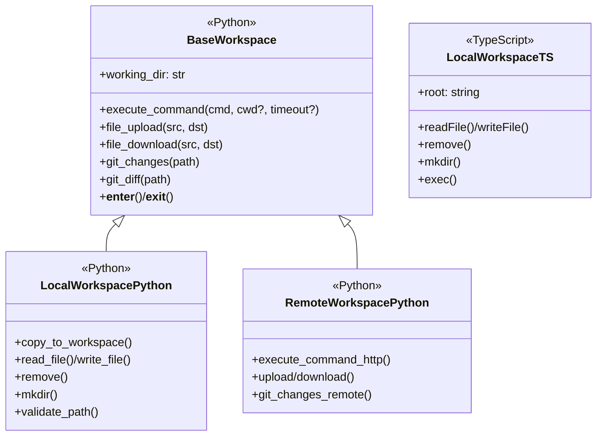
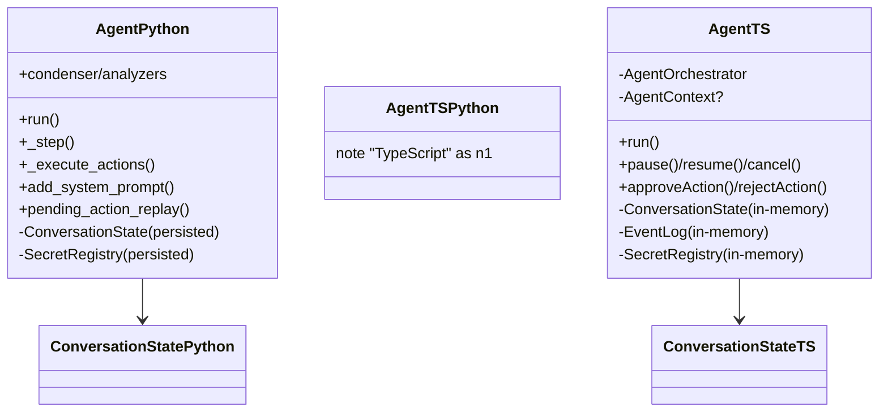
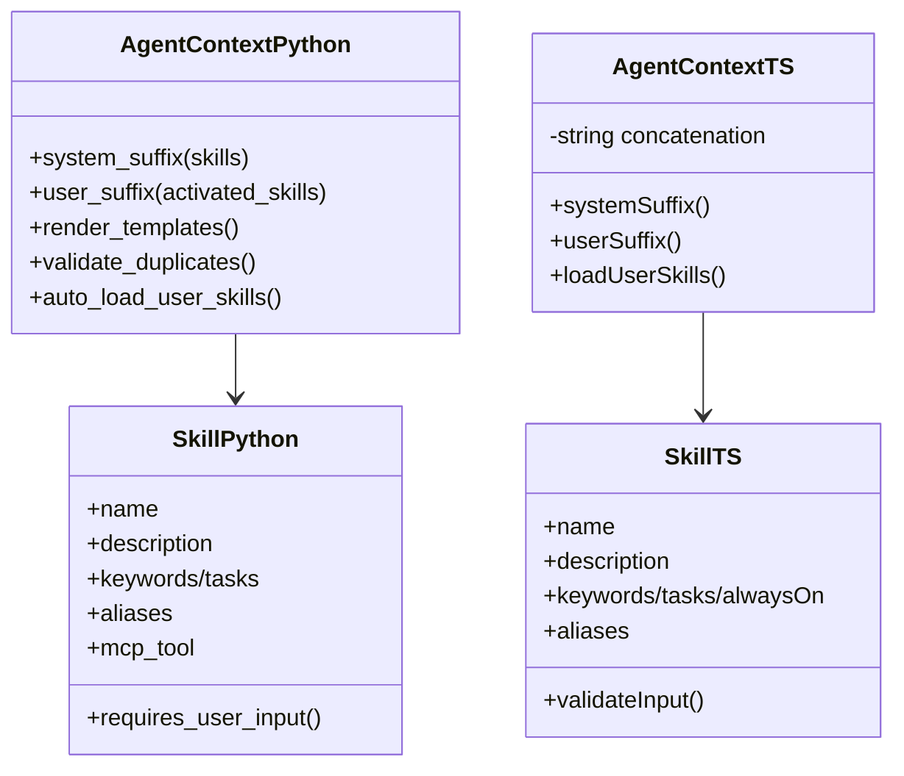
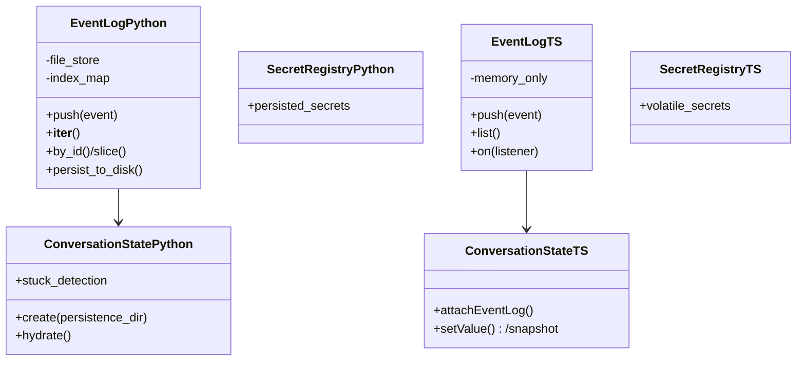

# Python ↔︎ TypeScript SDK parity guide

This document compares the Python `agent-sdk` (reference implementation) with the TypeScript `@openhands/agent-sdk-ts` (VS Code-focused SDK). It highlights where interfaces align, where behavior diverges, and what is missing for parity. Mermaid diagrams summarize key classes and relationships in each layer.

## Workspace layer

### Python shape

- Factory `Workspace()`
  - Returns `LocalWorkspace` or `RemoteWorkspace` based on `host`/`api_key`
  - Shares `BaseWorkspace` with `working_dir`, context-manager support, and discriminated union typing
- `LocalWorkspace`
  - Command execution with timeout/error metadata
  - Git change/diff helpers
  - Upload/download/copy operations
  - Strict path validation
- `RemoteWorkspace`
  - Wraps HTTP endpoints for commands, file transfer, and git metadata
  - Mirrors `CommandResult`/`FileOperationResult` schemas
  - Queue-based locking

### TypeScript shape

- Only `LocalWorkspace` exists
  - Resolves workspace root
  - Reads/writes/removes files
  - Creates directories
  - Runs commands via VS Code APIs with minimal metadata
- No shared base class or factory
- No remote workspace or file transfer helpers

### Gaps to close

- Add workspace factory + base abstraction with `working_dir`, context manager/cleanup semantics, and discriminated typing for local vs remote
- Port upload/download/copy helpers, git change/diff models, and richer `CommandResult` fields (timeout, stderr segmentation)
- Implement remote workspace with HTTP-backed command lifecycle and path validation parity

### Source references
- Python: openhands/sdk/workspace/base.py BaseWorkspace; openhands/sdk/workspace/local.py LocalWorkspace; openhands/sdk/workspace/remote/base.py RemoteWorkspace; openhands/sdk/workspace/remote/remote_workspace_mixin.py RemoteWorkspaceMixin.
- TypeScript: packages/agent-sdk-ts/src/workspace/LocalWorkspace.ts LocalWorkspace.

## Conversation layer

### Python shape

- Factory `Conversation()`
  - Chooses `LocalConversation` vs `RemoteConversation` based on workspace type
  - Passes `persistence_dir`, `conversation_id`, callback stack, `max_iteration_per_run`, stuck detection toggle, visualizer implementation, and secrets
- `LocalConversation`
  - Runs the `Agent` loop
  - Persists events/state
  - Supports resume-from-disk
  - Exposes context-manager cleanup
- `RemoteConversation`
  - Prohibits persistence dir
  - Relays messages over HTTP/WebSocket
  - Mirrors confirmation/status callbacks
  - Replays history from the agent server

### TypeScript shape

- `Conversation()`
  - Selects `LocalConversation` (in-process) or `RemoteConversation` (WebSocket with HTTP history replay) based on `serverUrl` presence
- `LocalConversation`
  - Builds fresh `Agent`, `EventLog`, `ConversationState`, and `SecretRegistry`
  - Emits `status/event/error/conversationStarted/terminal`
  - Has no persistence or cleanup hooks
- `RemoteConversation`
  - Manages reconnect/replay and exposes settings mutation
  - Only proxies chat/events (no remote workspace/file helpers)

### Gaps to close

- Persistence-aware construction (resume from disk, persistence directory validation) and context-manager cleanup
- Visualizer/stuck-detection hooks, richer callback chaining, and secret injection aligned with Python's constructor signature
- Remote workspace-aware commands, git/file helpers, and HTTP fallback parity (TS remote mode only streams chat/events)

### Source references
- Python: openhands/sdk/conversation/conversation.py Conversation; openhands/sdk/conversation/base.py BaseConversation, ConversationStateProtocol; openhands/sdk/conversation/impl/local_conversation.py LocalConversation; openhands/sdk/conversation/impl/remote_conversation.py RemoteConversation; openhands/sdk/conversation/state.py ConversationState.
- TypeScript: packages/agent-sdk-ts/src/sdk/conversation/index.ts Conversation factory; packages/agent-sdk-ts/src/sdk/conversation/LocalConversation.ts LocalConversation; packages/agent-sdk-ts/src/sdk/conversation/RemoteConversation.ts RemoteConversation; packages/agent-sdk-ts/src/sdk/runtime/ConversationState.ts ConversationState.

## Agent lifecycle and orchestration

### Python shape

- `Agent` extends `AgentBase`
  - Injects system prompt with serialized tool schemas
  - Enforces confirmation/security via analyzers
  - Supports condenser pipelines plus observability hooks
- Drives `_step` loop
  - Deduplication
  - Condensed event windows
  - Dual LLM APIs (responses vs completions)
  - Pending-action replay with disk-backed `ConversationState`
- Integrates with `SecretRegistry` persistence, stuck detection, and configurable confirmation policies

### TypeScript shape

- `Agent` wraps `AgentOrchestrator`
  - Builds/attaches `EventLog`, `ConversationState`, `SecretRegistry`
  - Optional tools/LLM client and optional `AgentContext`
- Methods: `run`, `pause/resume`, `cancel`, `approveAction/rejectAction`
  - Enforces iteration cap
  - Confirmation policy enum
  - Executes tool calls with basic error handling
- No condenser, security analyzer, or persisted state replay
- Confirmation logic is minimal and local-only

### Gaps to close

- Add tool schema/security analyzer injection, condenser pipeline, and observability hooks around `runLoop`
- Support persisted `ConversationState` restoration and pending-action replay
- Implement responses-API parity and richer confirmation policies akin to Python analyzers

### Source references
- Python: openhands/sdk/agent/base.py AgentBase; openhands/sdk/agent/agent.py Agent; openhands/sdk/conversation/state.py ConversationState; openhands/sdk/conversation/conversation.py Conversation factory glue.
- TypeScript: packages/agent-sdk-ts/src/sdk/runtime/Agent.ts Agent; packages/agent-sdk-ts/src/sdk/runtime/AgentOrchestrator.ts AgentOrchestrator; packages/agent-sdk-ts/src/sdk/runtime/ConversationState.ts ConversationState; packages/agent-sdk-ts/src/sdk/runtime/SecretRegistry.ts SecretRegistry.

## AgentContext and skills

### Python AgentContext

- Pydantic model with repo-skill templating
  - Uses `system_message_suffix.j2` templates
  - Triggered knowledge rendering
  - Duplicate detection
  - Auto-loading of user skills with warnings
  - Structured metadata
- Produces both system and user suffixes
  - Templated variables
  - Activation tracking

### TypeScript AgentContext

- Lightweight class that concatenates always-on skills into Markdown
  - Appends optional suffix
  - Matches triggers via substring search
  - Logs warnings for duplicates
- Skill activation tracking is minimal
- Formatting is plain strings (no templating)

### Skill models

- **Python `Skill`**
  - Pydantic validation
  - Keyword/task triggers
  - Auto `/name` trigger for task skills
  - MCP tool metadata
  - Input validation helpers (`requires_user_input`)
  - Third-party aliasing
- **TypeScript `Skill`**
  - Mirrors keyword/task/always-on triggers
  - Aliasing and missing-variable prompts
  - Lacks MCP tool metadata
  - No schema validation
  - No regex triggers

### Gaps to close

- Introduce template-driven rendering for system/user suffixes and richer trigger matching (regex, keyword weighting)
- Add MCP tool metadata, schema validation, and structured activation logs to TypeScript skills

### Source references
- Python: openhands/sdk/context/agent_context.py AgentContext; openhands/sdk/context/skills/skill.py Skill; openhands/sdk/context/skills/types.py SkillKnowledge, SkillResponse, SkillContentResponse.
- TypeScript: packages/agent-sdk-ts/src/sdk/context/agent-context.ts AgentContext; packages/agent-sdk-ts/src/sdk/context/skills/skill.ts Skill, SkillValidationError.

## Event logging, persistence, and events

### EventLog/persistence

- **Python `EventLog`**
  - File-backed with deterministic filenames/indices
  - Duplicate-ID detection
  - Slicing/iteration helpers
  - Integration with:
    - `EventsListBase`: iteration and index helpers
    - `persistence_const`: directory and filename patterns
    - `serialization_diff`: state diffing
    - FIFO locks: cross-process locking
  - `ConversationState.create`: hydrates state (iteration counts, stuck detection) from disk
  - `SecretRegistry`: persists secrets
- **TypeScript `EventLog`**
  - In-memory only
  - Normalizes IDs/timestamps
  - Broadcasts listeners
  - Supports `push/list/on`
  - `ConversationState`: in-memory with optional `attachEventLog`
  - `SecretRegistry`: non-persisted

### Gaps to close

- Add file-backed storage with deterministic naming/indexing and duplicate protection
- Port persistence constants, diffing, and cross-process locks
- Persist secrets and conversation state for resume/replay

## Tool schema parity

- Introduced zod-backed tool definitions for `browser_use`, `delegate`, `glob`, `grep`, and `planning_file_editor` so the TypeScript
  SDK mirrors the Python tool descriptions and annotations. Structured tools now surface JSON Schema parameters in the system
  prompt to keep VS Code behavior aligned with the reference SDK.
- Expose hydration helpers mirroring Python's `ConversationState.create`

### Event interface coverage

- **Python event classes** (Pydantic models in `openhands.sdk.event`):
  - A suite of event classes including:
    - `SystemPromptEvent`
    - `ActionEvent`
    - `ObservationEvent`
    - `UserRejectObservation`
    - `MessageEvent`
    - `AgentErrorEvent`
    - `ConversationErrorEvent`
    - `TokenEvent`
    - `PauseEvent`
    - `Condensation`
    - `CondensationRequest`
    - `CondensationSummaryEvent`
    - `ConversationStateUpdateEvent`
  - All events extend `Event`/`LLMConvertibleEvent`
  - Include fields: `id`, `timestamp`, `source`, and type-specific data (tool call IDs, reasoning, summaries)
- **TypeScript event interfaces** (`src/sdk/types`):
  - Mirrors most Python events using discriminated `kind` property:
    - `SystemPromptEvent`
    - `ActionEvent`
    - `ObservationEvent`
    - `UserRejectObservation`
    - `MessageEvent`
    - `AgentErrorEvent`
    - `ConversationErrorEvent`
    - `PauseEvent`
    - `Condensation`
    - `ConversationStateUpdateEvent`
  - Lacks:
    - `TokenEvent`
    - Condensation request/summary variants
  - Metadata fields are narrower (e.g., no stuck-detection or condenser fields)

### Source references
- Python: openhands/sdk/conversation/event_store.py EventLog; openhands/sdk/conversation/state.py ConversationState; openhands/sdk/conversation/persistence_const.py persistence constants; openhands/sdk/event/types.py event discriminators; openhands/sdk/event/conversation_state.py ConversationStateUpdateEvent; openhands/sdk/event/conversation_error.py ConversationErrorEvent; openhands/sdk/event/token.py TokenEvent; openhands/sdk/event/user_action.py ActionEvent/UserRejectObservation; openhands/sdk/event/condenser.py condensation events; openhands/sdk/event/base.py Event/LLMConvertibleEvent.
- TypeScript: packages/agent-sdk-ts/src/sdk/runtime/EventLog.ts EventLog; packages/agent-sdk-ts/src/sdk/runtime/ConversationState.ts ConversationState; packages/agent-sdk-ts/src/sdk/runtime/SecretRegistry.ts SecretRegistry; packages/agent-sdk-ts/src/sdk/types/index.ts SystemPromptEvent, MessageEvent, ActionEvent, ObservationEvent, ConversationStateUpdateEvent, ConversationErrorEvent, PauseEvent, Condensation, is* guards.

## Quick checklist for parity work
- Implement workspace factory/base with remote support, path validation, git helpers, and richer command metadata.
- Extend conversations with persistence, visualizer/stuck-detection hooks, callback stacks, and remote workspace helpers.
- Augment agent with condenser/security analyzers, persisted state replay, and expanded confirmation policies.
- Add template-aware `AgentContext`, MCP-aware `Skill` metadata/validation, and richer trigger matching.
- Provide file-backed `EventLog`, state/secret persistence helpers, and the missing event variants (`TokenEvent`, condensation request/summary).
